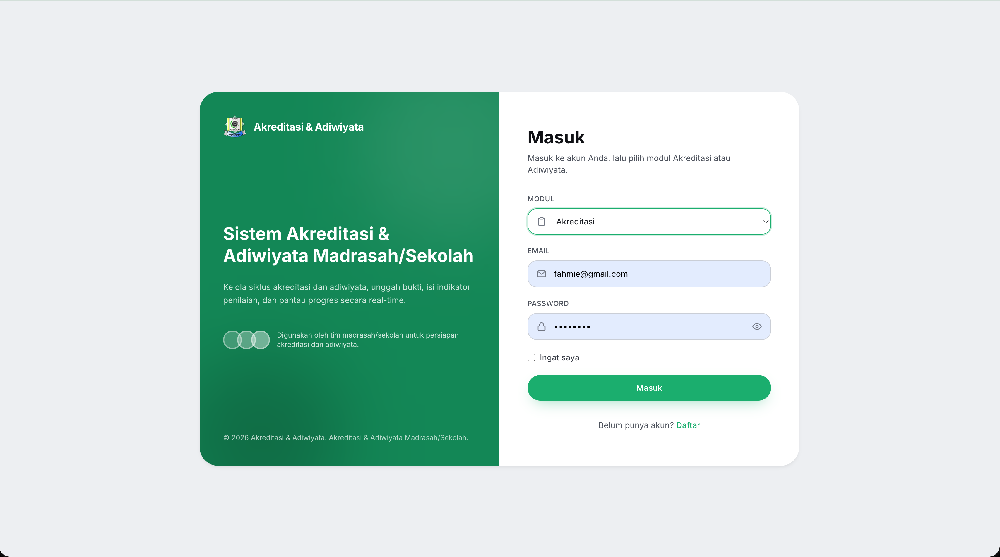

<div align="center">

# 📋 MutuApp

**Sistem Informasi Manajemen Mutu Sekolah**

*Akreditasi & Adiwiyata — Satu Platform, Dua Modul Mutu*

[](https://laravel.com)
[](https://livewire.laravel.com)
[](https://php.net)
[](https://tailwindcss.com)
[](LICENSE)

</div>

---

## 📖 Tentang MutuApp

**MutuApp** adalah aplikasi manajemen mutu sekolah berbasis web yang dirancang untuk membantu sekolah di Indonesia mengelola dua aspek penting:

### 🎯 Modul Akreditasi
Mengelola seluruh siklus akreditasi sekolah secara digital:
- **Instrumen & Indikator** — Memuat instrumen akreditasi lengkap dengan rubrik penilaian dan level-levelnya
- **Pengisian oleh Guru** — Guru mengisi bukti dan skor pada indikator yang ditugaskan
- **Monitoring oleh Kepala Sekolah** — Kepala sekolah memantau progres pengisian di setiap siklus
- **Manajemen Bukti** — Unggah bukti akreditasi (dokumen digital) dengan relasi ke indikator
- **Saran Bukti** — Sistem memberikan saran bukti yang relevan untuk setiap indikator

### 🌱 Modul Adiwiyata
Mendukung penuh program Adiwiyata (Sekolah Peduli Lingkungan):
- **24 Indikator Adiwiyata** — Implementasi penuh 24 indikator dari standar resmi
- **Siklus Penilaian** — Dukungan multi-siklus untuk evaluasi berkala
- **Pengisian Jawaban & Bukti** — Guru mengisi jawaban dan melampirkan bukti pendukung
- **Komponen Mutu** — Pemetaan indikator ke komponen mutu Adiwiyata

---

## 📸 Tampilan Aplikasi



*Halaman login dengan pilihan modul Akreditasi atau Adiwiyata.*

---

## ✨ Fitur Unggulan

| Fitur | Deskripsi |
|-------|-----------|
| 🔐 **Autentikasi Multi-Role** | Login & register dengan role **Kepala Sekolah** dan **Guru** |
| 🔄 **Modul Switching** | Berpindah antara modul Akreditasi dan Adiwiyata dalam satu klik |
| 📊 **Dashboard** | Ringkasan progres dan status masing-masing modul |
| 📄 **Manajemen Bukti Digital** | Unggah, kelola, dan tautkan bukti ke indikator |
| 🎨 **Tampilan Kostumisasi** | Profil, avatar, tema, dan pengaturan appearance |
| 📱 **Responsif** | Antarmuka responsif dengan Tailwind CSS 4 |
| 📋 **Ekspor Data** | Dukungan export data menggunakan OpenSpout (Excel/CSV) |
| 📎 **Parser PDF** | Ekstraksi teks dari dokumen PDF menggunakan smalot/pdfparser |

---

## 🏗️ Arsitektur

```
akreditasi-app/
├── app/
│   ├── Livewire/            # Komponen Livewire interaktif
│   │   ├── Accreditation/   #   - Modul Akreditasi
│   │   │   ├── Index.php
│   │   │   ├── TeacherFilling.php
│   │   │   ├── IndicatorList.php
│   │   │   └── Monitoring.php
│   │   ├── Adiwiyata/       #   - Modul Adiwiyata
│   │   │   ├── Index.php
│   │   │   ├── Components.php
│   │   │   └── Filling.php
│   │   ├── Admin/
│   │   │   └── Dashboard.php
│   │   ├── Auth/
│   │   │   ├── Login.php
│   │   │   └── Register.php
│   │   └── Settings/
│   │       ├── Profile.php
│   │       ├── Appearance.php
│   │       └── Theme.php
│   ├── Models/               # Model Eloquent
│   │   ├── School.php
│   │   ├── Accreditation*.php
│   │   ├── Adiwiyata*.php
│   │   └── User.php
│   └── Http/Controllers/
├── database/
│   └── migrations/           # Migrasi database
├── routes/
│   └── web.php               # Definisi rute
├── resources/views/          # Template Blade + Livewire
└── refdesign/                # Referensi desain UI
```

### Model Data Utama

**Akreditasi:**
`School` → `AccreditationCycle` → `AccreditationComponent` → `AccreditationInstrument` → `AccreditationIndicator` → `AccreditationEvidence`

**Adiwiyata:**
`School` → `AdiwiyataCycle` → `AdiwiyataComponent` → `AdiwiyataIndicator` → `AdiwiyataEvidence`

---

## 🚀 Instalasi

### Prasyarat

- PHP ^8.3
- Composer
- Node.js & npm
- MySQL / PostgreSQL / SQLite
- Redis (opsional, untuk queue)

### Langkah Instalasi

```bash
# 1. Clone repositori
git clone https://github.com/eldorray/mutu-app.git
cd mutu-app

# 2. Install dependensi PHP
composer install

# 3. Install dependensi frontend
npm install

# 4. Salin environment file
cp .env.example .env

# 5. Generate application key
php artisan key:generate

# 6. Konfigurasi database di .env
#    DB_DATABASE=mutu_app
#    DB_USERNAME=root
#    DB_PASSWORD=

# 7. Jalankan migrasi
php artisan migrate

# 8. (Opsional) Seed data awal
php artisan db:seed

# 9. Build aset frontend
npm run build

# 10. Jalankan development server
composer run dev
```

Akses aplikasi di `http://localhost:8000`

---

## 🧑‍💻 Pengembangan

### Perintah Penting

| Perintah | Deskripsi |
|----------|-----------|
| `composer run dev` | Jalankan dev server + queue listener + Vite hot reload |
| `composer run lint` | Format kode dengan Laravel Pint |
| `composer run test` | Jalankan test suite (Pest) |
| `npm run build` | Build aset produksi |
| `php artisan migrate:fresh --seed` | Reset database + seed ulang |

### Role & Routing

- **Guest:** Login, Register
- **Guru:** Dashboard, Pengisian Akreditasi, Pengisian Adiwiyata
- **Kepala Sekolah (Kepsek):** Dashboard, Monitoring Akreditasi
- **Semua User:** Settings (Profile, Appearance, Theme)

---

## 🛠️ Teknologi

| Teknologi | Kegunaan |
|-----------|----------|
| **[Laravel 13](https://laravel.com)** | Framework PHP utama |
| **[Livewire 4](https://livewire.laravel.com)** | Komponen interaktif tanpa JavaScript berat |
| **[Tailwind CSS 4](https://tailwindcss.com)** | Utility-first CSS framework |
| **[Vite](https://vitejs.dev)** | Build tool frontend |
| **[Pest](https://pestphp.com)** | Testing framework |
| **[Laravel Pint](https://github.com/laravel/pint)** | Code style fixer |
| **[OpenSpout](https://github.com/openspout/openspout)** | Export data (Excel/CSV) |
| **[smalot/pdfparser](https://github.com/smalot/pdfparser)** | Parsing dokumen PDF |

---

## 🗺️ Roadmap

- [x] Autentikasi multi-role (Guru & Kepala Sekolah)
- [x] Modul Akreditasi — siklus, indikator, pengisian, monitoring
- [x] Modul Adiwiyata — 24 indikator, bukti, siklus
- [ ] Manajemen data sekolah
- [ ] Dashboard analitik & visualisasi progres
- [ ] Ekspor laporan PDF
- [ ] Manajemen pengguna oleh admin
- [ ] Notifikasi & reminder pengisian
- [ ] API untuk integrasi eksternal

---

## 🤝 Kontribusi

Kontribusi selalu disambut! Silakan buka *issue* atau kirim *pull request* untuk perbaikan dan fitur baru.

1. Fork repositori
2. Buat branch fitur (`git checkout -b feat/fitur-keren`)
3. Commit perubahan (`git commit -m 'feat: tambah fitur keren'`)
4. Push ke branch (`git push origin feat/fitur-keren`)
5. Buka Pull Request

---

## 📄 Lisensi

[MIT](LICENSE) © Eldorray

---

<div align="center">
Dibangun dengan ❤️ untuk kemajuan pendidikan Indonesia
</div>
