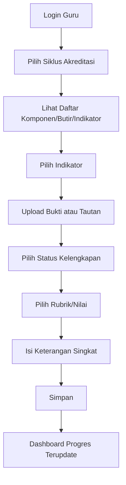
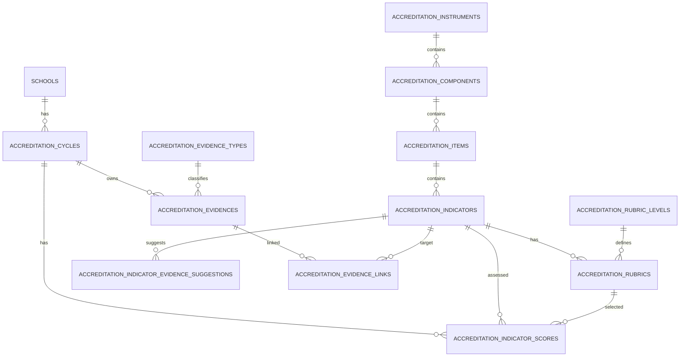

# Blueprint Aplikasi Web Akreditasi IA2024 Dasmen 2025 - Laravel + Livewire

Dokumen ini merancang aplikasi agar **guru/tim madrasah tidak perlu mengetik master instrumen lagi**. Master butir, indikator, level rubrik, pilihan bukti, dan deskripsi rubrik diisi melalui seeder. Setelah itu guru cukup:

1. memilih siklus akreditasi,
2. membuka indikator yang menjadi tanggung jawabnya,
3. mengunggah bukti kelengkapan atau menempelkan tautan bukti,
4. memilih nilai/rubrik: **Kurang, Cukup Baik, Baik, Sangat Baik, atau N/A bila berlaku**,
5. mengisi keterangan singkat.

Sumber data yang digunakan dalam rancangan ini adalah DKA, ceklis kelengkapan dokumen, dan Panduan Penjelasan IA2024 Dasmen versi 2025. IA2024 menilai kinerja sekolah/madrasah secara substansial, bukan sekadar kelengkapan dokumen administratif. Bukti pendukung bersifat terbuka dan kontekstual, sedangkan rubrik penilaian memakai 4 kategori.

---

## 1. Mekanisme aplikasi

### 1.1 Peran pengguna

| Peran | Akses utama |
|---|---|
| Super Admin | Menjalankan seeder master instrumen, mengelola tahun/instrumen |
| Admin Madrasah | Membuat profil madrasah, siklus akreditasi, dan pembagian tugas |
| Guru/Tim Akreditasi | Upload bukti, menautkan bukti ke indikator, memilih nilai, mengisi keterangan |
| Kepala Madrasah | Melihat progres, memvalidasi kelengkapan, mengunci siklus |
| Reviewer Internal | Mengecek bukti, memberi catatan revisi, melihat rekap nilai |

### 1.2 Alur kerja guru



### 1.3 Prinsip data

Master data disimpan sekali melalui seeder:

```text
Instrumen -> Komponen -> Butir -> Indikator -> Rubrik Level -> Rubrik Detail
```

Data yang diisi guru disimpan per siklus:

```text
Siklus Akreditasi -> Bukti -> Link Bukti ke Indikator -> Nilai/Keterangan Indikator
```

Dengan pola ini, guru hanya mengerjakan data operasional, sedangkan master instrumen tidak perlu dibuat ulang.

---

## 2. Ringkasan butir instrumen yang di-seed

| Butir | Pernyataan Butir | Jumlah Indikator |
|---:|---|---:|
| 1 | Pendidik menyediakan dukungan sosial emosional bagi peserta didik dalam proses pembelajaran | 4 indikator |
| 2 | Pendidik mengelola kelas untuk menciptakan suasana belajar yang aman, nyaman, dan mendukung tercapainya tujuan pembelajaran | 3 indikator |
| 3 | Pendidik mengelola proses pembelajaran secara efektif dan bermakna | 5 indikator |
| 4 | Pendidik memfasilitasi pembelajaran yang efektif dalam membangun keimanan, ketakwaan, komitmen kebangsaan, kemampuan bernalar dan memecahkan masalah, serta karakter dan kompetensi lainnya yang relevan bagi peserta didik | 4 indikator |
| 5 | Kepala satuan pendidikan menerapkan budaya refleksi untuk perbaikan pembelajaran yang berpusat pada peserta didik, serta evaluasi kinerja untuk rencana pengembangan profesional bagi pendidik dan tenaga kependidikan | 4 indikator |
| 6 | Kepala satuan pendidikan menghadirkan layanan belajar yang partisipatif dan kolaboratif untuk tercapainya visi dan misi | 4 indikator |
| 7 | Kepala satuan pendidikan memastikan pengelolaan anggaran dilakukan sesuai perencanaan berdasarkan refleksi yang berbasis data secara transparan dan akuntabel | 3 indikator |
| 8 | Kepala satuan pendidikan memimpin pengelolaan sarana dan prasarana sesuai dengan kebutuhan pembelajaran yang berpusat pada peserta didik | 2 indikator |
| 9 | Kepala satuan pendidikan mengembangkan kurikulum di tingkat satuan pendidikan yang selaras dengan kurikulum nasional | 3 indikator |
| 10 | Satuan pendidikan memastikan terbangunnya iklim kebinekaan bagi peserta didik, pendidik, dan tenaga kependidikan | 3 indikator |
| 11 | Satuan pendidikan menyediakan lingkungan belajar yang inklusif untuk memenuhi kebutuhan belajar peserta didik yang beragam | 2 indikator |
| 12 | Satuan pendidikan mewujudkan iklim lingkungan belajar yang aman secara psikis bagi peserta didik, pendidik, dan tenaga kependidikan | 2 indikator |
| 13 | Satuan pendidikan memastikan keselamatan peserta didik, pendidik, dan tenaga kependidikan | 3 indikator |
| 14 | Satuan pendidikan menjamin lingkungan yang sehat dan memiliki/melaksanakan program yang membangun kesehatan fisik dan mental pada peserta didik, pendidik, dan tenaga kependidikan | 3 indikator |

---

## 3. Daftar indikator yang di-seed

| Kode | Butir | Indikator | Bisa N/A | Kontekstual |
|---|---:|---|---|---|
| 1.1.1 | 1 | Interaksi guru dengan murid yang setara dan menghargai | Tidak | Tidak |
| 1.1.2 | 1 | Interaksi yang membangun pola pikir bertumbuh | Tidak | Tidak |
| 1.1.3 | 1 | Memberi perhatian dan bantuan pada murid yang membutuhkan dukungan lebih/ekstra | Tidak | Tidak |
| 1.1.4 | 1 | Strategi pengajaran yang membangun keterampilan sosial emosional pada murid | Tidak | Tidak |
| 1.2.1 | 2 | Kesepakatan kelas yang disusun secara partisipatif | Tidak | Tidak |
| 1.2.2 | 2 | Penegakan disiplin dengan pendekatan positif | Tidak | Tidak |
| 1.2.3 | 2 | Waktu di kelas terfokus pada kegiatan belajar | Tidak | Tidak |
| 1.3.1 | 3 | pembelajaran Perencanaan yang memadai untuk mendukung pelaksanaan | Tidak | Tidak |
| 1.3.2 | 3 | Penilaian formatif digunakan sebagai umpan balik dalam proses pembelajaran | Tidak | Tidak |
| 1.3.3 | 3 | Penilaian sumatif dilakukan dengan metode menggunakan instrumen yang sesuai dengan tujuan pembelajaran yang beragam | Tidak | Tidak |
| 1.3.4 | 3 | Hasil penilaian dilaporkan secara informatif untuk mendorong tindak lanjut perbaikan | Tidak | Tidak |
| 1.3.5 | 3 | Praktik pengajaran yang memfasilitasi murid untuk menganalisis, mengutarakan gagasan, dan menghubungkan pengetahuannya dengan pengetahuan baru dan konteks aplikatif | Tidak | Tidak |
| 1.4.1 | 4 | Pembelajaran yang efektif menguatkan keimanan dan ketakwaan murid pada Tuhan YME untuk membentuk akhlak yang mulia | Tidak | Tidak |
| 1.4.2 | 4 | Pembelajaran yang efektif dalam menguatkan kecintaan terhadap sejarah, kekayaan budaya, alam Indonesia, pemikiran, dan karya anak bangsa | Tidak | Tidak |
| 1.4.3 | 4 | Pembelajaran yang efektif dalam memfasilitasi mengembangkan kemampuan bernalar dan memecahkan masalah murid untuk | Tidak | Tidak |
| 1.4.4 | 4 | Pembelajaran yang efektif dalam membangun kompetensi dan/atau karakter yang menjadi misi utama sekolah/madrasah | Ya | Tidak |
| 2.5.1 | 5 | Fasilitasi kepada guru dan tenaga kependidikan untuk melakukan refleksi kinerja dalam rangka perbaikan pembelajaran | Tidak | Tidak |
| 2.5.2 | 5 | Evaluasi kinerja dilakukan oleh kepsek kepada guru dan tendik dalam rangka meningkatkan kualitas pembelajaran yang dilakukan secara berkala dan sistematis | Tidak | Tidak |
| 2.5.3 | 5 | Program pengembangan profesional guru untuk peningkatan kualitas pembelajaran telah dilakukan | Tidak | Tidak |
| 2.5.4 | 5 | Pengelolaan guru dan tenaga kependidikan yang efektif dan akuntabel dalam hal pemberian kompensasi, penghargaan atau sanksi berbasis kinerja | Tidak | Tidak |
| 2.6.1 | 6 | Visi dan misi sekolah/madrasah yang jelas dan dipahami oleh berbagai pemangku kepentingan | Tidak | Tidak |
| 2.6.2 | 6 | Adanya kolaborasi atau kemitraan dengan berbagai pihak (termasuk orang tua/wali, mitra, dudi, dst) dalam rangka mendukung penyelenggaraan layanan pendidikan secara efektif | Tidak | Tidak |
| 2.6.3 | 6 | Pelaksanaan evaluasi/refleksi berbasis data yang melibatkan berbagai pihak yang relevan | Tidak | Tidak |
| 2.6.4 | 6 | Perencanaan kegiatan tahunan dilakukan berdasarkan data yang diperoleh dari evaluasi/refleksi | Tidak | Tidak |
| 2.7.1 | 7 | Anggaran sekolah/madrasah dikelola sesuai dengan perencanaan tahunan | Tidak | Tidak |
| 2.7.2 | 7 | Rencana anggaran sekolah/madrasah menunjukkan sumber pendanaan serta alokasi pemanfaatannya | Tidak | Tidak |
| 2.7.3 | 7 | Ada laporan berkala tentang pemanfaatan anggaran sekolah/madrasah kepada pemangku kepentingan | Tidak | Tidak |
| 2.8.1 | 8 | Pemenuhan sarana dan prasarana yang sesuai dengan kebutuhan belajar murid (dapat disediakan secara mandiri maupun bermitra) | Tidak | Tidak |
| 2.8.2 | 8 | Pengelolaan sarana dan prasarana secara optimal | Tidak | Tidak |
| 2.9.1 | 9 | Kepemilikan kurikulum penyelenggaraan proses pembelajaran satuan pendidikan sebagai rujukan | Tidak | Tidak |
| 2.9.2 | 9 | Adanya mekanisme evaluasi terhadap penerapan kurikulum | Tidak | Tidak |
| 2.9.3 | 9 | Kurikulum satuan pendidikan relevan dengan kebutuhan belajar murid dan visi misi sekolah/madrasah | Tidak | Tidak |
| 3.10.1 | 10 | keberagaman Iklim pembelajaran yang membangun nilai positif terhadap | Tidak | Tidak |
| 3.10.2 | 10 | Iklim lingkungan belajar yang memfasilitasi hak sipil warga sekolah/madrasah untuk beribadah dan berbudaya | Ya | Tidak |
| 3.10.3 | 10 | Iklim lingkungan belajar membangun kesadaran terhadap kesetaraan gender | Tidak | Ya |
| 3.11.1 | 11 | Kebijakan dan/atau prosedur yang menghadirkan lingkungan belajar yang inklusif | Tidak | Tidak |
| 3.11.2 | 11 | Program bagi guru, orang tua/wali, dan murid untuk menghadirkan lingkungan belajar yang inklusif | Ya | Tidak |
| 3.12.1 | 12 | Kebijakan dalam pencegahan dan penanganan perundungan dan kekerasan | Tidak | Tidak |
| 3.12.2 | 12 | Program bagi warga sekolah/madrasah dalam pencegahan dan penanganan perundungan dan kekerasan | Tidak | Tidak |
| 3.13.1 | 13 | sekolah/madrasah Lingkungan belajar yang menjaga keselamatan warga | Tidak | Tidak |
| 3.13.2 | 13 | Melaksanakan prosedur dan perlengkapan Pertolongan Pertama pada Kecelakaan (P3K) | Tidak | Tidak |
| 3.13.3 | 13 | Kesiapan sekolah/madrasah dalam menghadapi ragam potensi bencana | Tidak | Tidak |
| 3.14.1 | 14 | Iklim lingkungan belajar membangun pola hidup bersih dan sehat | Tidak | Tidak |
| 3.14.2 | 14 | Program untuk membangun kesehatan mental pada murid, guru, dan tenaga kependidikan | Tidak | Tidak |
| 3.14.3 | 14 | Edukasi tentang pencegahan adiksi dan kesehatan reproduksi | Tidak | Tidak |

Catatan:

- **Bisa N/A** berarti aplikasi perlu menampilkan tombol `N/A` dan kolom alasan.
- **Kontekstual** berarti rubrik berbeda berdasarkan konteks. Pada data ini, indikator `3.10.3` memiliki rubrik konteks `heterogen` dan `homogen`.

---

## 4. ERD database



---

## 5. Struktur database utama

### 5.1 Tabel master

| Tabel | Fungsi |
|---|---|
| `accreditation_instruments` | Menyimpan versi instrumen, contoh `IA2024-DASMEN-2025` |
| `accreditation_components` | Komponen 1, 2, dan 3 |
| `accreditation_items` | Butir 1 sampai 14 |
| `accreditation_indicators` | Indikator seperti `1.1.1`, `2.6.2`, `3.14.3` |
| `accreditation_rubric_levels` | Level nilai 1-4: Kurang sampai Sangat Baik |
| `accreditation_rubrics` | Deskripsi rubrik per indikator dan level |
| `accreditation_evidence_types` | Jenis bukti: dokumen, foto, video, tautan, observasi, wawancara, lainnya |
| `accreditation_indicator_evidence_suggestions` | Saran bukti per indikator |

### 5.2 Tabel operasional

| Tabel | Fungsi |
|---|---|
| `schools` | Profil madrasah/sekolah |
| `accreditation_cycles` | Siklus akreditasi per sekolah dan tahun |
| `accreditation_evidences` | File/link bukti yang diunggah guru |
| `accreditation_evidence_links` | Penghubung bukti ke indikator atau butir |
| `accreditation_indicator_scores` | Status kelengkapan, rubrik terpilih, nilai, dan keterangan guru |

---

## 6. Migration utama

Simpan contoh migration berikut sebagai:

```text
database/migrations/2025_01_01_000000_create_accreditation_tables.php
```

```php
<?php

use Illuminate\Database\Migrations\Migration;
use Illuminate\Database\Schema\Blueprint;
use Illuminate\Support\Facades\Schema;

return new class extends Migration
{
    public function up(): void
    {
        Schema::create('accreditation_instruments', function (Blueprint $table) {
            $table->id();
            $table->string('code')->unique();
            $table->string('name');
            $table->string('version')->nullable();
            $table->year('year')->nullable();
            $table->boolean('is_active')->default(false);
            $table->timestamps();
        });

        Schema::create('accreditation_components', function (Blueprint $table) {
            $table->id();
            $table->foreignId('instrument_id')->constrained('accreditation_instruments')->cascadeOnDelete();
            $table->unsignedInteger('number');
            $table->string('name');
            $table->unsignedInteger('sort_order')->default(0);
            $table->timestamps();
            $table->unique(['instrument_id', 'number']);
        });

        Schema::create('accreditation_items', function (Blueprint $table) {
            $table->id();
            $table->foreignId('component_id')->constrained('accreditation_components')->cascadeOnDelete();
            $table->unsignedInteger('number');
            $table->text('title');
            $table->text('dka_prompt')->nullable();
            $table->unsignedInteger('sort_order')->default(0);
            $table->timestamps();
            $table->unique(['component_id', 'number']);
        });

        Schema::create('accreditation_indicators', function (Blueprint $table) {
            $table->id();
            $table->foreignId('item_id')->constrained('accreditation_items')->cascadeOnDelete();
            $table->string('code');
            $table->text('title');
            $table->longText('definition')->nullable();
            $table->boolean('is_na_allowed')->default(false);
            $table->text('na_condition')->nullable();
            $table->boolean('is_contextual')->default(false);
            $table->unsignedInteger('sort_order')->default(0);
            $table->timestamps();
            $table->unique(['item_id', 'code']);
        });

        Schema::create('accreditation_rubric_levels', function (Blueprint $table) {
            $table->id();
            $table->string('code')->unique();
            $table->string('label');
            $table->unsignedTinyInteger('score_value');
            $table->unsignedInteger('sort_order')->default(0);
            $table->timestamps();
        });

        Schema::create('accreditation_rubrics', function (Blueprint $table) {
            $table->id();
            $table->foreignId('indicator_id')->constrained('accreditation_indicators')->cascadeOnDelete();
            $table->foreignId('rubric_level_id')->constrained('accreditation_rubric_levels')->cascadeOnDelete();
            $table->string('context')->nullable(); // contoh: heterogen/homogen pada indikator 3.10.3
            $table->longText('description');
            $table->timestamps();
            $table->unique(['indicator_id', 'rubric_level_id', 'context'], 'rubric_unique_context');
        });

        Schema::create('accreditation_evidence_types', function (Blueprint $table) {
            $table->id();
            $table->string('code')->unique();
            $table->string('name');
            $table->timestamps();
        });

        Schema::create('accreditation_indicator_evidence_suggestions', function (Blueprint $table) {
            $table->id();
            $table->foreignId('indicator_id')->constrained('accreditation_indicators')->cascadeOnDelete();
            $table->string('name');
            $table->unsignedInteger('sort_order')->default(0);
            $table->timestamps();
            $table->unique(['indicator_id', 'name'], 'indicator_evidence_suggestion_unique');
        });

        Schema::create('schools', function (Blueprint $table) {
            $table->id();
            $table->string('npsn')->nullable()->index();
            $table->string('name');
            $table->string('level')->nullable();
            $table->text('address')->nullable();
            $table->string('principal_name')->nullable();
            $table->timestamps();
        });

        Schema::create('accreditation_cycles', function (Blueprint $table) {
            $table->id();
            $table->foreignId('school_id')->constrained('schools')->cascadeOnDelete();
            $table->foreignId('instrument_id')->constrained('accreditation_instruments')->restrictOnDelete();
            $table->year('year');
            $table->string('status')->default('draft');
            $table->timestamp('submitted_at')->nullable();
            $table->timestamp('locked_at')->nullable();
            $table->timestamps();
            $table->unique(['school_id', 'instrument_id', 'year']);
        });

        Schema::create('accreditation_evidences', function (Blueprint $table) {
            $table->id();
            $table->foreignId('cycle_id')->constrained('accreditation_cycles')->cascadeOnDelete();
            $table->foreignId('evidence_type_id')->constrained('accreditation_evidence_types')->restrictOnDelete();
            $table->foreignId('uploaded_by')->constrained('users')->restrictOnDelete();
            $table->string('title');
            $table->text('description')->nullable();
            $table->string('file_path')->nullable();
            $table->text('external_url')->nullable();
            $table->string('verification_status')->default('pending');
            $table->text('verification_note')->nullable();
            $table->timestamps();
        });

        Schema::create('accreditation_evidence_links', function (Blueprint $table) {
            $table->id();
            $table->foreignId('evidence_id')->constrained('accreditation_evidences')->cascadeOnDelete();
            $table->foreignId('indicator_id')->nullable()->constrained('accreditation_indicators')->cascadeOnDelete();
            $table->foreignId('item_id')->nullable()->constrained('accreditation_items')->cascadeOnDelete();
            $table->text('note')->nullable();
            $table->timestamps();
            $table->index(['indicator_id', 'item_id']);
        });

        Schema::create('accreditation_indicator_scores', function (Blueprint $table) {
            $table->id();
            $table->foreignId('cycle_id')->constrained('accreditation_cycles')->cascadeOnDelete();
            $table->foreignId('indicator_id')->constrained('accreditation_indicators')->cascadeOnDelete();
            $table->foreignId('rubric_id')->nullable()->constrained('accreditation_rubrics')->nullOnDelete();
            $table->foreignId('assessed_by')->nullable()->constrained('users')->nullOnDelete();
            $table->string('checklist_status')->default('belum_diisi'); // lengkap/tidak_lengkap/perlu_revisi/na
            $table->boolean('is_na')->default(false);
            $table->string('rubric_context')->nullable();
            $table->unsignedTinyInteger('score_value')->nullable();
            $table->longText('teacher_note')->nullable();
            $table->timestamps();
            $table->unique(['cycle_id', 'indicator_id']);
        });
    }

    public function down(): void
    {
        Schema::dropIfExists('accreditation_indicator_scores');
        Schema::dropIfExists('accreditation_evidence_links');
        Schema::dropIfExists('accreditation_evidences');
        Schema::dropIfExists('accreditation_cycles');
        Schema::dropIfExists('schools');
        Schema::dropIfExists('accreditation_indicator_evidence_suggestions');
        Schema::dropIfExists('accreditation_evidence_types');
        Schema::dropIfExists('accreditation_rubrics');
        Schema::dropIfExists('accreditation_rubric_levels');
        Schema::dropIfExists('accreditation_indicators');
        Schema::dropIfExists('accreditation_items');
        Schema::dropIfExists('accreditation_components');
        Schema::dropIfExists('accreditation_instruments');
    }
};

```

---

## 7. Cara menampilkan form guru di Livewire

### 7.1 Route

```php
Route::middleware(['auth'])->group(function () {
    Route::get('/akreditasi/{cycle}/pengisian', App\Livewire\Accreditation\TeacherFillingPage::class)
        ->name('accreditation.teacher-filling');
});
```

### 7.2 Query data indikator untuk form

```php
$indicators = AccreditationIndicator::query()
    ->with([
        'item.component',
        'rubrics.level',
        'evidenceSuggestions',
    ])
    ->orderBy('sort_order')
    ->get();
```

### 7.3 Bentuk komponen Livewire sederhana

```php
<?php

namespace App\Livewire\Accreditation;

use Livewire\Component;
use Livewire\WithFileUploads;
use Illuminate\Support\Facades\Storage;
use App\Models\AccreditationCycle;
use App\Models\AccreditationEvidence;
use App\Models\AccreditationEvidenceLink;
use App\Models\AccreditationIndicator;
use App\Models\AccreditationIndicatorScore;
use App\Models\AccreditationRubric;

class TeacherFillingPage extends Component
{
    use WithFileUploads;

    public AccreditationCycle $cycle;
    public ?int $selectedIndicatorId = null;
    public ?int $selectedRubricId = null;
    public string $checklistStatus = 'belum_diisi';
    public bool $isNa = false;
    public ?string $teacherNote = null;
    public ?string $evidenceTitle = null;
    public ?string $externalUrl = null;
    public $file;

    public function selectIndicator(int $indicatorId): void
    {
        $this->selectedIndicatorId = $indicatorId;

        $score = AccreditationIndicatorScore::where('cycle_id', $this->cycle->id)
            ->where('indicator_id', $indicatorId)
            ->first();

        $this->selectedRubricId = $score?->rubric_id;
        $this->checklistStatus = $score?->checklist_status ?? 'belum_diisi';
        $this->isNa = (bool) ($score?->is_na ?? false);
        $this->teacherNote = $score?->teacher_note;
    }

    public function saveScore(): void
    {
        $indicator = AccreditationIndicator::findOrFail($this->selectedIndicatorId);
        $rubric = $this->selectedRubricId ? AccreditationRubric::with('level')->findOrFail($this->selectedRubricId) : null;

        if ($this->isNa && ! $indicator->is_na_allowed) {
            $this->addError('isNa', 'Indikator ini tidak memperbolehkan N/A.');
            return;
        }

        AccreditationIndicatorScore::updateOrCreate(
            [
                'cycle_id' => $this->cycle->id,
                'indicator_id' => $indicator->id,
            ],
            [
                'rubric_id' => $this->isNa ? null : $rubric?->id,
                'assessed_by' => auth()->id(),
                'checklist_status' => $this->isNa ? 'na' : $this->checklistStatus,
                'is_na' => $this->isNa,
                'rubric_context' => $rubric?->context,
                'score_value' => $this->isNa ? null : $rubric?->level?->score_value,
                'teacher_note' => $this->teacherNote,
            ]
        );

        session()->flash('success', 'Nilai dan keterangan berhasil disimpan.');
    }

    public function uploadEvidence(): void
    {
        $this->validate([
            'selectedIndicatorId' => ['required', 'exists:accreditation_indicators,id'],
            'evidenceTitle' => ['required', 'string', 'max:255'],
            'file' => ['nullable', 'file', 'max:10240'],
            'externalUrl' => ['nullable', 'url'],
        ]);

        $path = $this->file ? $this->file->store('akreditasi/evidences', 'public') : null;

        $evidence = AccreditationEvidence::create([
            'cycle_id' => $this->cycle->id,
            'evidence_type_id' => 1, // sesuaikan dengan pilihan user
            'uploaded_by' => auth()->id(),
            'title' => $this->evidenceTitle,
            'file_path' => $path,
            'external_url' => $this->externalUrl,
            'verification_status' => 'pending',
        ]);

        AccreditationEvidenceLink::create([
            'evidence_id' => $evidence->id,
            'indicator_id' => $this->selectedIndicatorId,
        ]);

        $this->reset(['evidenceTitle', 'externalUrl', 'file']);
        session()->flash('success', 'Bukti berhasil diunggah.');
    }

    public function render()
    {
        return view('livewire.accreditation.teacher-filling-page', [
            'indicators' => AccreditationIndicator::with(['item.component', 'rubrics.level', 'evidenceSuggestions'])
                ->orderBy('sort_order')
                ->get(),
        ]);
    }
}
```

---

## 8. Tampilan Blade ringkas

```blade
<div class="grid grid-cols-12 gap-4">
    <aside class="col-span-4 space-y-2">
        @foreach($indicators as $indicator)
            <button wire:click="selectIndicator({ $indicator->id })" class="w-full text-left border rounded p-3">
                <div class="font-semibold">{ $indicator->code }</div>
                <div>{ $indicator->title }</div>
            </button>
        @endforeach
    </aside>

    <section class="col-span-8 border rounded p-4">
        @if($selectedIndicatorId)
            <h2 class="text-lg font-bold">Pengisian Indikator</h2>

            <label>Status Kelengkapan</label>
            <select wire:model="checklistStatus" class="w-full border rounded">
                <option value="belum_diisi">Belum Diisi</option>
                <option value="lengkap">Lengkap</option>
                <option value="tidak_lengkap">Tidak Lengkap</option>
                <option value="perlu_revisi">Perlu Revisi</option>
            </select>

            <label class="mt-4 block">Pilih Rubrik/Nilai</label>
            <select wire:model="selectedRubricId" class="w-full border rounded">
                <option value="">Pilih nilai</option>
                @foreach($indicators->firstWhere('id', $selectedIndicatorId)?->rubrics ?? [] as $rubric)
                    <option value="{ $rubric->id }">
                        { $rubric->level->label }{ $rubric->context ? ' - '.$rubric->context : '' }
                    </option>
                @endforeach
            </select>

            <label class="mt-4 block">Keterangan Guru</label>
            <textarea wire:model="teacherNote" class="w-full border rounded" rows="5"></textarea>

            <button wire:click="saveScore" class="mt-4 px-4 py-2 rounded bg-slate-900 text-white">
                Simpan Nilai
            </button>

            <hr class="my-6">

            <h3 class="font-bold">Upload Bukti</h3>
            <input type="text" wire:model="evidenceTitle" placeholder="Judul bukti" class="w-full border rounded mb-2">
            <input type="file" wire:model="file" class="w-full border rounded mb-2">
            <input type="url" wire:model="externalUrl" placeholder="Atau tautan Google Drive/YouTube" class="w-full border rounded mb-2">
            <button wire:click="uploadEvidence" class="px-4 py-2 rounded bg-blue-700 text-white">
                Upload Bukti
            </button>
        @else
            <p>Pilih indikator terlebih dahulu.</p>
        @endif
    </section>
</div>
```

---

## 9. Seeder master instrumen dan rubrik lengkap

Simpan file berikut sebagai:

```text
database/seeders/AccreditationInstrumentSeeder.php
```

Lalu jalankan:

```bash
php artisan db:seed --class=AccreditationInstrumentSeeder
```

```php
<?php

namespace Database\Seeders;

use Illuminate\Database\Seeder;
use Illuminate\Support\Facades\DB;

class AccreditationInstrumentSeeder extends Seeder
{
    public function run(): void
    {
        $data = [
            'instrument' => [
                'code' => 'IA2024-DASMEN-2025',
                'name' => 'Instrumen Akreditasi 2024 SD/MI, SMP/MTs, SMA/MA',
                'version' => '2025',
                'year' => 2025,
                'is_active' => true
            ],
            'rubric_levels' => [
                [
                    'code' => 'kurang',
                    'label' => 'Kurang',
                    'score_value' => 1,
                    'sort_order' => 1
                ],
                [
                    'code' => 'cukup_baik',
                    'label' => 'Cukup Baik',
                    'score_value' => 2,
                    'sort_order' => 2
                ],
                [
                    'code' => 'baik',
                    'label' => 'Baik',
                    'score_value' => 3,
                    'sort_order' => 3
                ],
                [
                    'code' => 'sangat_baik',
                    'label' => 'Sangat Baik',
                    'score_value' => 4,
                    'sort_order' => 4
                ]
            ],
            'evidence_types' => [
                [
                    'code' => 'dokumen',
                    'name' => 'Dokumen'
                ],
                [
                    'code' => 'foto',
                    'name' => 'Foto'
                ],
                [
                    'code' => 'video',
                    'name' => 'Video'
                ],
                [
                    'code' => 'tautan',
                    'name' => 'Tautan'
                ],
                [
                    'code' => 'observasi',
                    'name' => 'Catatan Observasi'
                ],
                [
                    'code' => 'wawancara',
                    'name' => 'Catatan Wawancara'
                ],
                [
                    'code' => 'lainnya',
                    'name' => 'Lainnya'
                ]
            ],
            'components' => [
                [
                    'number' => 1,
                    'name' => 'Kinerja Pendidik dalam Mengelola Proses Pembelajaran yang Berpusat pada Peserta Didik'
                ],
                [
                    'number' => 2,
                    'name' => 'Kepemimpinan Kepala Satuan Pendidikan dalam Pengelolaan Satuan Pendidikan'
                ],
                [
                    'number' => 3,
                    'name' => 'Iklim Lingkungan Belajar'
                ]
            ],
            'items' => [
                [
                    'number' => 1,
                    'component_number' => 1,
                    'title' => 'Pendidik menyediakan dukungan sosial emosional bagi peserta didik dalam proses pembelajaran',
                    'dka_prompt' => 'Ceritakan keterpenuhan kinerja butir yang mencakup semua indikator.'
                ],
                [
                    'number' => 2,
                    'component_number' => 1,
                    'title' => 'Pendidik mengelola kelas untuk menciptakan suasana belajar yang aman, nyaman, dan mendukung tercapainya tujuan pembelajaran',
                    'dka_prompt' => 'Ceritakan keterpenuhan kinerja butir yang mencakup semua indikator.'
                ],
                [
                    'number' => 3,
                    'component_number' => 1,
                    'title' => 'Pendidik mengelola proses pembelajaran secara efektif dan bermakna',
                    'dka_prompt' => 'Ceritakan keterpenuhan kinerja butir yang mencakup semua indikator.'
                ],
                [
                    'number' => 4,
                    'component_number' => 1,
                    'title' => <<<'TXT'
Pendidik memfasilitasi pembelajaran yang efektif dalam membangun keimanan, ketakwaan, komitmen kebangsaan, kemampuan bernalar dan memecahkan masalah, serta karakter dan kompetensi lainnya yang relevan bagi peserta didik
TXT,
                    'dka_prompt' => 'Ceritakan keterpenuhan kinerja butir yang mencakup semua indikator.'
                ],
                [
                    'number' => 5,
                    'component_number' => 2,
                    'title' => <<<'TXT'
Kepala satuan pendidikan menerapkan budaya refleksi untuk perbaikan pembelajaran yang berpusat pada peserta didik, serta evaluasi kinerja untuk rencana pengembangan profesional bagi pendidik dan tenaga kependidikan
TXT,
                    'dka_prompt' => 'Ceritakan keterpenuhan kinerja butir yang mencakup semua indikator.'
                ],
                [
                    'number' => 6,
                    'component_number' => 2,
                    'title' => 'Kepala satuan pendidikan menghadirkan layanan belajar yang partisipatif dan kolaboratif untuk tercapainya visi dan misi',
                    'dka_prompt' => 'Ceritakan keterpenuhan kinerja butir yang mencakup semua indikator.'
                ],
                [
                    'number' => 7,
                    'component_number' => 2,
                    'title' => 'Kepala satuan pendidikan memastikan pengelolaan anggaran dilakukan sesuai perencanaan berdasarkan refleksi yang berbasis data secara transparan dan akuntabel',
                    'dka_prompt' => 'Ceritakan keterpenuhan kinerja butir yang mencakup semua indikator.'
                ],
                [
                    'number' => 8,
                    'component_number' => 2,
                    'title' => 'Kepala satuan pendidikan memimpin pengelolaan sarana dan prasarana sesuai dengan kebutuhan pembelajaran yang berpusat pada peserta didik',
                    'dka_prompt' => 'Ceritakan keterpenuhan kinerja butir yang mencakup semua indikator.'
                ],
                [
                    'number' => 9,
                    'component_number' => 2,
                    'title' => 'Kepala satuan pendidikan mengembangkan kurikulum di tingkat satuan pendidikan yang selaras dengan kurikulum nasional',
                    'dka_prompt' => 'Ceritakan keterpenuhan kinerja butir yang mencakup semua indikator.'
                ],
                [
                    'number' => 10,
                    'component_number' => 3,
                    'title' => 'Satuan pendidikan memastikan terbangunnya iklim kebinekaan bagi peserta didik, pendidik, dan tenaga kependidikan',
                    'dka_prompt' => 'Ceritakan keterpenuhan kinerja butir yang mencakup semua indikator.'
                ],
                [
                    'number' => 11,
                    'component_number' => 3,
                    'title' => 'Satuan pendidikan menyediakan lingkungan belajar yang inklusif untuk memenuhi kebutuhan belajar peserta didik yang beragam',
                    'dka_prompt' => 'Ceritakan keterpenuhan kinerja butir yang mencakup semua indikator.'
                ],
                [
                    'number' => 12,
                    'component_number' => 3,
                    'title' => 'Satuan pendidikan mewujudkan iklim lingkungan belajar yang aman secara psikis bagi peserta didik, pendidik, dan tenaga kependidikan',
                    'dka_prompt' => 'Ceritakan keterpenuhan kinerja butir yang mencakup semua indikator.'
                ],
                [
                    'number' => 13,
                    'component_number' => 3,
                    'title' => 'Satuan pendidikan memastikan keselamatan peserta didik, pendidik, dan tenaga kependidikan',
                    'dka_prompt' => 'Ceritakan keterpenuhan kinerja butir yang mencakup semua indikator.'
                ],
                [
                    'number' => 14,
                    'component_number' => 3,
                    'title' => 'Satuan pendidikan menjamin lingkungan yang sehat dan memiliki/melaksanakan program yang membangun kesehatan fisik dan mental pada peserta didik, pendidik, dan tenaga kependidikan',
                    'dka_prompt' => 'Ceritakan keterpenuhan kinerja butir yang mencakup semua indikator.'
                ]
            ],
            'indicators' => [
                [
                    'code' => '1.1.1',
                    'title' => 'Interaksi guru dengan murid yang setara dan menghargai',
                    'definition' => 'Kinerja guru dalam berinteraksi dengan murid selama proses pembelajaran agar murid merasa aman untuk bertanya, berpendapat, berdiskusi, dan tidak takut salah.',
                    'rubrics' => [
                        [
                            'level' => 'kurang',
                            'description' => <<<'TXT'
Ketika murid bertanya atau berkomentar, guru:
- Mengabaikan, atau
- Menanggapi dengan merendahkan atau menggunakan bahasa
berindikasi stigma, stereotipe, atau label negatif
TXT,
                            'context' => null
                        ],
                        [
                            'level' => 'cukup_baik',
                            'description' => <<<'TXT'
Guru memberi kesempatan murid bertanya/berkomentar, namun:
- Hanya mendengar sepintas dan menanggapi seperlunya
- Terburu-buru menjawab tanpa memastikan pemahaman murid
TXT,
                            'context' => null
                        ],
                        [
                            'level' => 'baik',
                            'description' => <<<'TXT'
Guru memberi kesempatan murid bertanya/berkomentar, kemudian:
- Mendengarkan dengan saksama
- Menanggapi dengan tanggapan yang relevan
- Memberi kesempatan pada tiga atau lebih murid untuk bertanya atau
memberi masukan/komentar
TXT,
                            'context' => null
                        ],
                        [
                            'level' => 'sangat_baik',
                            'description' => <<<'TXT'
Guru memberi kesempatan murid bertanya/berkomentar, kemudian:
- Mendengarkan dengan saksama,
- Menanggapi dengan penggalian lebih lanjut,
- Menggunakan bahasa yang membangun semangat;
- Memberi kesempatan pada tiga atau lebih murid untuk bertanya atau
memberi masukan/komentar
TXT,
                            'context' => null
                        ]
                    ],
                    'evidence_suggestions' => [
                        'Hasil observasi proses pembelajaran',
                        'Hasil wawancara dengan minimal 5 orang murid',
                        'Bukti lain yang relevan'
                    ],
                    'component_number' => 1,
                    'item_number' => 1,
                    'sort_order' => 1,
                    'is_na_allowed' => false,
                    'na_condition' => null,
                    'is_contextual' => false
                ],
                [
                    'code' => '1.1.2',
                    'title' => 'Interaksi yang membangun pola pikir bertumbuh',
                    'definition' => 'Kinerja guru dalam membangun kepercayaan diri murid bahwa kemampuan dirinya dapat terus berkembang dan mampu mencapai tujuan pembelajaran.',
                    'rubrics' => [
                        [
                            'level' => 'kurang',
                            'description' => <<<'TXT'
Dalam memberikan umpan balik, guru berfokus kepada hasil belajar saja, tanpa memberikan komentar atas proses dan usaha murid. Guru menyampaikan (kepada murid atau asesor) bahwa ada murid yang memang kurang mampu atau berbakat akademik, dan mereka sulit diharapkan bisa meningkatkan kemampuan dan prestasi akademiknya.
TXT,
                            'context' => null
                        ],
                        [
                            'level' => 'cukup_baik',
                            'description' => <<<'TXT'
Guru memberi umpan balik kepada murid yang masih berfokus pada hasil belajar mereka, tetapi sudah memuat penghargaan atau harapan umum,
meskipun belum spesifik menyebutkan upaya atau perilaku murid yang pantas diapresiasi. Guru tidak secara eksplisit menyampaikan (kepada murid atau asesor) bahwa ada murid yang memang kurang mampu atau berbakat akademik, dan mereka sulit diharapkan bisa meningkatkan kemampuan dan prestasi akademiknya.
TXT,
                            'context' => null
                        ],
                        [
                            'level' => 'baik',
                            'description' => <<<'TXT'
Selain fokus kepada hasil belajar, guru juga:
- memberikan penghargaan atas usaha murid, dengan menyebutkan
secara spesifik perilaku dan/atau upaya murid yang pantas diapresiasi
- menyampaikan (kepada murid atau asesor) bahwa murid yang kurang
berprestasi pun bisa meningkat kemampuan dan prestasi akademiknya asalkan mereka menerapkan strategi dan usaha yang tepat.
TXT,
                            'context' => null
                        ],
                        [
                            'level' => 'sangat_baik',
                            'description' => <<<'TXT'
Guru memberi umpan balik yang berfokus pada penghargaan atas usaha murid, dengan menyebutkan perilaku atau usaha spesifik yang pantas diapresiasi, serta menjelaskan kepada seluruh kelas tentang mengapa perilaku atau usaha tersebut pantas diapresiasi. Guru secara eksplisit menyampaikan (kepada murid atau asesor) bahwa murid yang kurang berprestasi pun bisa meningkat kemampuan dan prestasi akademiknya asalkan mereka menerapkan strategi dan usaha yang tepat, serta menjelaskan atau menunjukkan praktik yang sudah dilakukan agar murid-murid tersebut percaya bahwa mereka bisa menjadi lebih pandai dan berprestasi.
TXT,
                            'context' => null
                        ]
                    ],
                    'evidence_suggestions' => [
                        'Telaah dokumen/dokumentasi',
                        'Hasil wawancara dengan perwakilan guru',
                        'Hasil wawancara dengan minimal 5 orang murid',
                        'Bukti lain yang relevan'
                    ],
                    'component_number' => 1,
                    'item_number' => 1,
                    'sort_order' => 2,
                    'is_na_allowed' => false,
                    'na_condition' => null,
                    'is_contextual' => false
                ],
                [
                    'code' => '1.1.3',
                    'title' => 'Memberi perhatian dan bantuan pada murid yang membutuhkan dukungan lebih/ekstra',
                    'definition' => 'Kinerja guru dalam mengidentifikasi murid yang memerlukan dukungan lebih/ekstra dan memberikan pendampingan agar murid dapat mencapai tujuan pembelajaran.',
                    'rubrics' => [
                        [
                            'level' => 'kurang',
                            'description' => <<<'TXT'
Guru belum berupaya mengidentifikasi murid yang memerlukan dukungan lebih/ekstra untuk mencapai tujuan pembelajaran di kelasnya. Belum ada upaya untuk memberi dukungan lebih/ekstra bagi murid tertentu.
TXT,
                            'context' => null
                        ],
                        [
                            'level' => 'cukup_baik',
                            'description' => <<<'TXT'
Guru menggunakan pengamatan informal atau bertanya pada pihak lain untuk mengidentifikasi murid yang memiliki kebutuhan khusus (yang terlihat secara kasat mata), namun belum berupaya mengidentifikasi murid yang memerlukan dukungan lebih/ekstra (dalam pembelajaran) di luar mereka yang berkebutuhan khusus.
TXT,
                            'context' => null
                        ],
                        [
                            'level' => 'baik',
                            'description' => <<<'TXT'
Guru menggunakan pengamatan informal atau bertanya pada pihak lain untuk mengidentifikasi murid yang memiliki kebutuhan khusus (yang terlihat secara kasat mata), serta murid yang memerlukan dukungan ekstra (dalam pembelajaran) di luar mereka yang berkebutuhan khusus. Guru membuat perencanaan dan berupaya mengumpulkan sumber daya untuk memberi dukungan ekstra bagi murid untuk mencapai tujuan pembelajaran.
TXT,
                            'context' => null
                        ],
                        [
                            'level' => 'sangat_baik',
                            'description' => <<<'TXT'
Guru menggunakan pengamatan informal, bertanya pada pihak lain, serta metode yang lebih sistematis untuk mengidentifikasi murid yang memiliki kebutuhan khusus (yang terlihat secara kasat mata), serta murid yang memerlukan dukungan ekstra (dalam pembelajaran) di luar mereka yang berkebutuhan khusus. Guru melibatkan murid dan orang tua dalam membuat perencanaan dan berupaya mengumpulkan sumber daya untuk memberi dukungan ekstra bagi murid yang teridentifikasi memerlukan dukungan ekstra untuk mencapai tujuan pembelajaran.
TXT,
                            'context' => null
                        ]
                    ],
                    'evidence_suggestions' => [
                        'Telaah dokumen/dokumentasi',
                        'Hasil wawancara dengan perwakilan guru',
                        'Hasil wawancara dengan minimal 5 orang murid',
                        'Bukti lain yang relevan'
                    ],
                    'component_number' => 1,
                    'item_number' => 1,
                    'sort_order' => 3,
                    'is_na_allowed' => false,
                    'na_condition' => null,
                    'is_contextual' => false
                ],
                [
                    'code' => '1.1.4',
                    'title' => 'Strategi pengajaran yang membangun keterampilan sosial emosional pada murid',
                    'definition' => <<<'TXT'
Penerapan strategi pengajaran yang membangun efikasi diri (self efficacy) pada diri murid. Efikasi diri adalah saat murid mampu mengelola emosinya dan memiliki keterampilan sosial emosional untuk mengatasi berbagai tantangan dalam proses pembelajaran. Indikator kinerja ini juga mengukur kompetensi guru dalam menerapkan berbagai strategi untuk mencapainya.
TXT,
                    'rubrics' => [
                        [
                            'level' => 'kurang',
                            'description' => <<<'TXT'
Guru cenderung mengabaikan atau menganggap ringan ketika ada murid yang menyampaikan keluhan atau ekspresi emosi negatif (misalnya, kebosanan, kelelahan, frustrasi, tidak tertarik pada materi pelajaran, kecewa, sedih, marah, dll). Guru belum memaknai pengelolaan emosi murid sebagai hal penting di dalam proses pembelajaran.
TXT,
                            'context' => null
                        ],
                        [
                            'level' => 'cukup_baik',
                            'description' => <<<'TXT'
Guru menunjukkan simpati ketika murid ada yang menyampaikan keluhan atau mengekspresikan emosi negatif (misalnya, kebosanan, kelelahan, frustrasi, tidak tertarik pada materi pelajaran, kecewa, sedih, marah, dll) terkait situasi yang menantang/sulit. Namun, belum berupaya memahami akar masalah maupun menindaklanjuti dengan tindakan/dukungan nyata. Guru memaknai pengelolaan emosi murid sebagai hal penting untuk mencapai tujuan pembelajaran, tetapi belum mempertimbangkan strategi untuk membangunnya.
TXT,
                            'context' => null
                        ],
                        [
                            'level' => 'baik',
                            'description' => <<<'TXT'
Guru menunjukkan simpati ketika murid ada yang menyampaikan keluhan atau mengekspresikan emosi negatif (misalnya, kebosanan, kelelahan, frustrasi, tidak tertarik pada materi pelajaran, kecewa, sedih, marah, dll) terkait situasi yang menantang/sulit. Guru juga berupaya memahami akar masalah serta menindaklanjuti dengan memberi pendampingan atau tindakan nyata lain secara spontan (belum terencana).
TXT,
                            'context' => null
                        ],
                        [
                            'level' => 'sangat_baik',
                            'description' => <<<'TXT'
Guru menunjukkan simpati ketika murid ada yang menyampaikan keluhan atau mengekspresikan emosi negatif (misalnya, kebosanan, kelelahan, frustrasi, tidak tertarik pada materi pelajaran, kecewa, sedih, marah, dll.) terkait situasi yang menantang/sulit. Guru juga berupaya memahami akar masalah serta menindaklanjuti dengan memberi pendampingan atau tindakan nyata lain yang telah dirancang untuk menguatkan kemandirian dan kemampuan murid mengelola emosi.
TXT,
                            'context' => null
                        ]
                    ],
                    'evidence_suggestions' => [
                        'Telaah dokumen/dokumentasi',
                        'Hasil observasi proses pembelajaran',
                        'Hasil wawancara dengan perwakilan guru',
                        'Hasil wawancara dengan minimal 5 orang murid',
                        'Bukti lain yang relevan'
                    ],
                    'component_number' => 1,
                    'item_number' => 1,
                    'sort_order' => 4,
                    'is_na_allowed' => false,
                    'na_condition' => null,
                    'is_contextual' => false
                ],
                [
                    'code' => '1.2.1',
                    'title' => 'Kesepakatan kelas yang disusun secara partisipatif',
                    'definition' => <<<'TXT'
Indikator ini mengukur penerapan kesepakatan kelas sebagai strategi untuk mengatur cara murid dan guru berperilaku selama pembelajaran berlangsung dan disusun dengan memperhatikan aspirasi murid.
TXT,
                    'rubrics' => [
                        [
                            'level' => 'kurang',
                            'description' => 'Tidak ada kesepakatan kelas (atau kesepakatan kelas tidak ditampilkan)',
                            'context' => null
                        ],
                        [
                            'level' => 'cukup_baik',
                            'description' => 'Ada kesepakatan kelas, tetapi penyusunannya tidak melibatkan murid, sehingga murid kurang memahami atau merasakan pentingnya isi dari kesepakatan tersebut.',
                            'context' => null
                        ],
                        [
                            'level' => 'baik',
                            'description' => <<<'TXT'
Ada kesepakatan kelas yang disusun dengan melibatkan murid, tetapi pelibatan masih kurang bermakna, sehingga sebagian murid tidak merasakan pentingnya isi kesepakatan tersebut sebagai acuan berperilaku.
TXT,
                            'context' => null
                        ],
                        [
                            'level' => 'sangat_baik',
                            'description' => <<<'TXT'
Ada kesepakatan kelas yang disusun dengan melibatkan murid secara bermakna, sehingga sebagian besar murid memahami arti penting isi kesepakatan tersebut dan secara sukarela berperan aktif menegakkannya (misalnya dengan saling mengingatkan atau menegur kawan yang melanggar).
TXT,
                            'context' => null
                        ]
                    ],
                    'evidence_suggestions' => [
                        'Hasil observasi proses pembelajaran',
                        'Hasil wawancara dengan perwakilan guru',
                        'Hasil wawancara dengan minimal 5 orang murid',
                        'Bukti lain yang relevan'
                    ],
                    'component_number' => 1,
                    'item_number' => 2,
                    'sort_order' => 5,
                    'is_na_allowed' => false,
                    'na_condition' => null,
                    'is_contextual' => false
                ],
                [
                    'code' => '1.2.2',
                    'title' => 'Penegakan disiplin dengan pendekatan positif',
                    'definition' => 'Indikator ini mengukur praktik pembelajaran di sekolah/madrasah yang tidak menggunakan tindakan agresif, baik secara verbal dan nonverbal dalam mengelola perilaku murid.',
                    'rubrics' => [
                        [
                            'level' => 'kurang',
                            'description' => <<<'TXT'
Dalam upaya membuat murid lebih disiplin, guru:
- Menggunakan bahasa yang kasar atau kurang sopan ketika menegur
murid.
- Menggunakan ancaman hukuman fisik, atau
- Menerapkan hukuman fisik pada murid.
TXT,
                            'context' => null
                        ],
                        [
                            'level' => 'cukup_baik',
                            'description' => <<<'TXT'
Dalam upaya membuat murid lebih disiplin, guru:
- Mengandalkan teguran meski dengan bahasa sopan/tidak kasar atau
ancaman nonfisik (misalnya, pemanggilan orang tua, pengurangan nilai, atau sanksi administratif lain), tanpa penjelasan tentang dampak negatif dari perilaku buruk atau kurang disiplin murid.
- Memberikan hukuman yang diberikan tidak relevan dengan dampak
negatif tersebut.
- TIDAK menggunakan ucapan yang menyakiti dan TIDAK menerapkan
hukuman fisik pada murid.
TXT,
                            'context' => null
                        ],
                        [
                            'level' => 'baik',
                            'description' => <<<'TXT'
Dalam upaya membuat murid lebih disiplin, guru:
- Masih menggunakan teguran dan ancaman (meski masih mungkin
menggunakannya secara sopan), tapi juga memberi penjelasan tentang dampak negatif dari perilaku buruk atau tidak disiplin murid.
- Memberi hukuman yang relevan untuk mengatasi dampak negatif
tersebut.
- TIDAK menggunakan ucapan yang menyakiti dan TIDAK menerapkan
hukuman fisik pada murid.
TXT,
                            'context' => null
                        ],
                        [
                            'level' => 'sangat_baik',
                            'description' => <<<'TXT'
Dalam upaya membuat murid lebih disiplin, Guru:
- Tidak lagi memberi ancaman, tapi mengajak murid berdialog untuk
merefleksikan dan menyadarkannya tentang dampak negatif dari perilaku buruk atau tidak disiplin murid.
- TIDAK menggunakan ucapan yang menyakiti dan TIDAK menerapkan
hukuman fisik pada murid.
TXT,
                            'context' => null
                        ]
                    ],
                    'evidence_suggestions' => [
                        'Hasil observasi proses pembelajaran',
                        'Hasil wawancara dengan perwakilan guru',
                        'Hasil wawancara dengan minimal 5 orang murid',
                        'Bukti lain yang relevan'
                    ],
                    'component_number' => 1,
                    'item_number' => 2,
                    'sort_order' => 6,
                    'is_na_allowed' => false,
                    'na_condition' => null,
                    'is_contextual' => false
                ],
                [
                    'code' => '1.2.3',
                    'title' => 'Waktu di kelas terfokus pada kegiatan belajar',
                    'definition' => 'Indikator ini mengukur kemampuan guru dalam mengelola suasana belajar sehingga tidak mengalami disrupsi yang mengalihkan perhatian dari aktivitas belajar.',
                    'rubrics' => [
                        [
                            'level' => 'kurang',
                            'description' => <<<'TXT'
Suasana kelas kacau untuk waktu yang cukup lama (lebih dari 10 menit) karena ada murid-murid yang melakukan kegiatan selain kegiatan pembelajaran. Murid yang ingin fokus belajar menjadi terganggu/terdistraksi.
TXT,
                            'context' => null
                        ],
                        [
                            'level' => 'cukup_baik',
                            'description' => <<<'TXT'
Suasana kelas kadang kacau karena ada murid yang melakukan kegiatan non-pembelajaran, namun hal itu berlangsung cukup singkat (kurang dari 10 menit). Murid yang ingin fokus belajar sempat terdistraksi, tetapi masih bisa melakukan aktivitas pembelajaran.
TXT,
                            'context' => null
                        ],
                        [
                            'level' => 'baik',
                            'description' => <<<'TXT'
Suasana kelas terfokus pada kegiatan pembelajaran. Masih ada murid yang melakukan kegiatan lain, namun dalam waktu yang singkat (kurang dari 5 menit) sehingga tidak mengganggu murid yang ingin fokus belajar.
TXT,
                            'context' => null
                        ],
                        [
                            'level' => 'sangat_baik',
                            'description' => 'Suasana kelas dan semua murid terfokus pada kegiatan pembelajaran. Banyak murid atau semua murid berpartisipasi aktif dalam kegiatan pembelajaran.',
                            'context' => null
                        ]
                    ],
                    'evidence_suggestions' => [
                        'Hasil observasi pembelajaran',
                        'Hasil wawancara dengan perwakilan guru',
                        'Bukti lain yang relevan'
                    ],
                    'component_number' => 1,
                    'item_number' => 2,
                    'sort_order' => 7,
                    'is_na_allowed' => false,
                    'na_condition' => null,
                    'is_contextual' => false
                ],
                [
                    'code' => '1.3.1',
                    'title' => 'pembelajaran Perencanaan yang memadai untuk mendukung pelaksanaan',
                    'definition' => <<<'TXT'
Kinerja guru dalam memastikan proses pembelajaran di kelas efektif untuk mencapai tujuan pembelajaran yang ditetapkan di tingkat sekolah/madrasah. Efektif artinya terdapat kejelasan tujuan, cara, teknik evaluasi, serta sumber belajar/materi yang relevan pada rancangan pembelajaran.
TXT,
                    'rubrics' => [
                        [
                            'level' => 'kurang',
                            'description' => 'Guru tidak memiliki dokumen RPP atau memiliki dokumen RPP yang tidak lengkap (tidak mencakup ketiga elemen esensial: hanya ada kegiatan saja).',
                            'context' => null
                        ],
                        [
                            'level' => 'cukup_baik',
                            'description' => <<<'TXT'
Guru memiliki dokumen RPP dan memuat ketiga elemen esensial (tujuan, kegiatan, dan penilaian). Namun tujuan pembelajaran yang dirumuskan belum berdasarkan silabus yang ditetapkan di tingkat sekolah. Guru memberi penjelasan yang logis/meyakinkan tentang kesesuaian kegiatan dengan tujuan pembelajaran. Tidak cukup bukti untuk menunjukkan ada persiapan materi untuk memastikan tujuan pembelajaran tercapai.
TXT,
                            'context' => null
                        ],
                        [
                            'level' => 'baik',
                            'description' => <<<'TXT'
Guru memiliki dokumen RPP yang memuat ketiga elemen esensial (tujuan, kegiatan, dan penilaian), dengan tujuan pembelajaran yang dirumuskan berdasarkan silabus.
Guru memberi penjelasan yang logis/meyakinkan tentang kesesuaian kegiatan dengan tujuan pembelajaran. Ada persiapan materi untuk memastikan tujuan pembelajaran tercapai.
TXT,
                            'context' => null
                        ],
                        [
                            'level' => 'sangat_baik',
                            'description' => <<<'TXT'
Guru memiliki dokumen RPP yang memuat ketiga elemen esensial (tujuan, kegiatan, dan penilaian), dengan tujuan pembelajaran yang dirumuskan berdasarkan silabus sekaligus didasarkan pada informasi tentang profil atau kebutuhan belajar murid. Guru memberi penjelasan yang logis/meyakinkan tentang kesesuaian kegiatan dengan tujuan pembelajaran. Ada persiapan materi untuk memastikan tujuan pembelajaran tercapai. Guru menjelaskan RPP pada murid, agar tujuan pembelajaran juga dipahami oleh murid.
TXT,
                            'context' => null
                        ]
                    ],
                    'evidence_suggestions' => [
                        'Telaah dokumen/dokumentasi',
                        'Hasil wawancara dengan perwakilan guru',
                        'Bukti lain yang relevan'
                    ],
                    'component_number' => 1,
                    'item_number' => 3,
                    'sort_order' => 8,
                    'is_na_allowed' => false,
                    'na_condition' => null,
                    'is_contextual' => false
                ],
                [
                    'code' => '1.3.2',
                    'title' => 'Penilaian formatif digunakan sebagai umpan balik dalam proses pembelajaran',
                    'definition' => <<<'TXT'
Kinerja guru dalam menerapkan penilaian/asesmen formatif yang memberikan informasi mengenai efektivitas dari proses pembelajaran dan menggunakan hasil tersebut untuk menyesuaikan proses belajar agar lebih optimal mencapai tujuan pembelajaran.
TXT,
                    'rubrics' => [
                        [
                            'level' => 'kurang',
                            'description' => 'Guru belum menerapkan penilaian formatif.',
                            'context' => null
                        ],
                        [
                            'level' => 'cukup_baik',
                            'description' => <<<'TXT'
Guru menerapkan penilaian formatif secara terbatas (hanya 1 kali dalam sebuah periode belajar, misalnya di awal semester), tetapi hasilnya belum digunakan untuk memperbaiki atau menyesuaikan kegiatan pembelajaran.
TXT,
                            'context' => null
                        ],
                        [
                            'level' => 'baik',
                            'description' => <<<'TXT'
Guru menerapkan penilaian formatif secara berkala (lebih dari 1 kali dalam sebuah periode belajar), dan hasilnya digunakan untuk memperbaiki atau menyesuaikan kegiatan pembelajaran.
TXT,
                            'context' => null
                        ],
                        [
                            'level' => 'sangat_baik',
                            'description' => <<<'TXT'
Guru menerapkan penilaian formatif secara berkala (lebih dari 1 kali dalam sebuah periode belajar), menggunakan hasilnya untuk memperbaiki atau menyesuaikan kegiatan pembelajaran, serta menyampaikan hasilnya secara cepat dan informatif untuk memotivasi atau membantu murid belajar dengan lebih baik.
TXT,
                            'context' => null
                        ]
                    ],
                    'evidence_suggestions' => [
                        'Telaah dokumen/dokumentasi',
                        'Hasil wawancara dengan perwakilan guru',
                        'Bukti lain yang relevan'
                    ],
                    'component_number' => 1,
                    'item_number' => 3,
                    'sort_order' => 9,
                    'is_na_allowed' => false,
                    'na_condition' => null,
                    'is_contextual' => false
                ],
                [
                    'code' => '1.3.3',
                    'title' => 'Penilaian sumatif dilakukan dengan metode menggunakan instrumen yang sesuai dengan tujuan pembelajaran yang beragam',
                    'definition' => <<<'TXT'
Kinerja guru dalam menerapkan asesmen sumatif yang memberikan informasi mendalam serta dengan menggunakan teknik dan instrumen penilaian yang sesuai dengan untuk mengukur ketercapaian tujuan pembelajaran.
TXT,
                    'rubrics' => [
                        [
                            'level' => 'kurang',
                            'description' => <<<'TXT'
Guru menerapkan penilaian sumatif hanya menggunakan satu metode (biasanya tes tertulis pilihan ganda dan jawaban singkat) yang dilakukan satu kali (biasanya pada akhir periode belajar), dengan instrumen yang
kurang sesuai untuk mengukur seberapa baik murid telah mencapai tujuan pembelajaran.
TXT,
                            'context' => null
                        ],
                        [
                            'level' => 'cukup_baik',
                            'description' => <<<'TXT'
Guru menerapkan penilaian sumatif masih menggunakan satu metode saja (biasanya tes tertulis pilihan ganda dan jawaban singkat), namun dilakukan lebih dari satu kali (tidak hanya di akhir periode belajar) dan instrumennya sudah sesuai untuk mengukur seberapa baik murid telah mencapai tujuan pembelajaran.
TXT,
                            'context' => null
                        ],
                        [
                            'level' => 'baik',
                            'description' => <<<'TXT'
Guru menerapkan penilaian sumatif dengan memadukan dua atau lebih metode (tidak hanya tes tertulis), yang dilakukan lebih dari satu kali (tidak hanya di akhir periode belajar) dan dengan instrumen yang sesuai untuk mengukur seberapa baik murid telah mencapai tujuan pembelajaran.
TXT,
                            'context' => null
                        ],
                        [
                            'level' => 'sangat_baik',
                            'description' => <<<'TXT'
Guru menerapkan penilaian sumatif dengan memadukan dua atau lebih metode, termasuk metode yang otentik (dapat mengembangkan kompetensi nonkognitif seperti komunikasi atau kolaborasi), dilakukan lebih dari satu kali (tidak hanya di akhir periode belajar), dan dengan instrumen yang sesuai untuk mengukur seberapa baik murid telah mencapai tujuan pembelajaran.
TXT,
                            'context' => null
                        ]
                    ],
                    'evidence_suggestions' => [
                        'Telaah dokumen/dokumentasi',
                        'Hasil wawancara dengan perwakilan guru',
                        'Bukti lain yang relevan'
                    ],
                    'component_number' => 1,
                    'item_number' => 3,
                    'sort_order' => 10,
                    'is_na_allowed' => false,
                    'na_condition' => null,
                    'is_contextual' => false
                ],
                [
                    'code' => '1.3.4',
                    'title' => 'Hasil penilaian dilaporkan secara informatif untuk mendorong tindak lanjut perbaikan',
                    'definition' => <<<'TXT'
Kinerja guru dalam menyusun laporan hasil belajar yang berisikan informasi tentang capaian dan kemajuan hasil belajar murid dan dikomunikasikan secara berkala kepada orang tua/wali murid dan murid.
TXT,
                    'rubrics' => [
                        [
                            'level' => 'kurang',
                            'description' => 'Laporan hasil belajar murid hanya berisi angka (tanpa deskripsi kualitatif). Laporan hasil belajar disampaikan kepada orang tua/wali murid tanpa proses dialog/diskusi.',
                            'context' => null
                        ],
                        [
                            'level' => 'cukup_baik',
                            'description' => <<<'TXT'
Laporan hasil belajar murid sudah memuat deskripsi kualitatif, namun terbatas pada penyebutan label (seperti baik atau kurang baik) tanpa penjelasan yang memadai. Laporan hasil belajar disampaikan kepada orang tua/wali murid dengan proses yang masih bersifat satu arah (dari guru ke orang tua/wali), dengan umpan balik yang kurang jelas implikasinya untuk tindak lanjut.
TXT,
                            'context' => null
                        ],
                        [
                            'level' => 'baik',
                            'description' => <<<'TXT'
Laporan hasil belajar murid sudah memuat deskripsi kualitatif yang cukup ekstensif disertai penjelasan yang memadai tentang apa yang sudah dikuasai dengan baik (dalam kaitannya dengan tujuan pembelajaran). Penyusunan laporan hasil belajar menggunakan mekanisme yang logis dan sistematis untuk menyusun laporan hasil belajar, dengan menggunakan: rubrik penilaian, serta hasil analisis terhadap hasil asesmen formatif dan sumatif. Laporan hasil belajar disampaikan kepada orang tua/wali murid dengan penyampaian umpan balik dan rencana tindak lanjut yang jelas secara dialogis (tidak hanya satu arah).
TXT,
                            'context' => null
                        ],
                        [
                            'level' => 'sangat_baik',
                            'description' => <<<'TXT'
Laporan hasil belajar murid sudah memuat deskripsi kualitatif yang cukup ekstensif disertai penjelasan yang memadai tentang apa yang sudah dikuasai dengan baik, dan apa yang masih belum dikuasai oleh murid (dalam kaitannya dengan tujuan pembelajaran). Penyusunan laporan hasil belajar menggunakan mekanisme yang logis dan sistematis untuk menyusun laporan hasil belajar, dengan menggunakan: rubrik penilaian, serta hasil analisis terhadap hasil asesmen formatif dan sumatif. Laporan hasil belajar disampaikan kepada orang tua/wali murid dengan penyampaian umpan balik dan rencana tindak lanjut yang jelas secara
dialogis (tidak hanya satu arah) serta melibatkan murid untuk melakukan refleksi diri dan membuat rencana tidak lanjut.
TXT,
                            'context' => null
                        ]
                    ],
                    'evidence_suggestions' => [
                        'Telaah dokumen/dokumentasi',
                        'Hasil wawancara dengan pimpinan sekolah/madrasah',
                        'Hasil wawancara dengan perwakilan guru',
                        'Hasil wawancara dengan orang tua/wali murid',
                        'Bukti lain yang relevan'
                    ],
                    'component_number' => 1,
                    'item_number' => 3,
                    'sort_order' => 11,
                    'is_na_allowed' => false,
                    'na_condition' => null,
                    'is_contextual' => false
                ],
                [
                    'code' => '1.3.5',
                    'title' => 'Praktik pengajaran yang memfasilitasi murid untuk menganalisis, mengutarakan gagasan, dan menghubungkan pengetahuannya dengan pengetahuan baru dan konteks aplikatif',
                    'definition' => 'Kinerja guru dalam menerapkan praktik pengajaran yang efektif untuk mencapai tujuan pembelajaran pada setiap mata pelajaran melalui proses pembelajaran yang mendalam.',
                    'rubrics' => [
                        [
                            'level' => 'kurang',
                            'description' => <<<'TXT'
Guru meminta murid menghafalkan materi dan menggunakan tes tertulis yang mengukur hafalan sebagai penilaian utama. Guru belum menerapkan tanya jawab, diskusi, pembelajaran kelompok, atau metode pembelajaran interaktif lain.
TXT,
                            'context' => null
                        ],
                        [
                            'level' => 'cukup_baik',
                            'description' => <<<'TXT'
Guru masih meminta murid menghafalkan materi, tetapi sudah berusaha menggunakan metode penilaian yang tidak hanya mengukur hafalan. Guru berusaha memandu tanya jawab, diskusi, pembelajaran kelompok, atau metode pembelajaran interaktif lain, tetapi praktiknya belum berhasil mendorong murid untuk mengaitkan materi yang sedang diajarkan dengan materi lain atau fenomena nyata.
TXT,
                            'context' => null
                        ],
                        [
                            'level' => 'baik',
                            'description' => <<<'TXT'
Guru secara eksplisit meminta murid untuk TIDAK hanya menghafalkan materi, dan sudah menggunakan metode penilaian yang dirancang mengukur pemahaman dan higher order thinking (tidak hanya mengukur hafalan). Guru memandu tanya jawab, diskusi, pembelajaran kelompok, atau metode pembelajaran interaktif lain dalam praktiknya sudah berhasil mendorong murid untuk mengaitkan materi yang sedang diajarkan dengan materi lain atau fenomena nyata.
TXT,
                            'context' => null
                        ],
                        [
                            'level' => 'sangat_baik',
                            'description' => <<<'TXT'
Guru secara eksplisit meminta murid untuk TIDAK hanya menghafalkan materi, sudah menggunakan metode penilaian yang dirancang mengukur pemahaman higher order thinking, serta melibatkan murid dalam refleksi tentang proses dan hasil belajar mereka. Guru memandu tanya jawab, diskusi, pembelajaran kelompok, atau metode pembelajaran interaktif lain dalam praktiknya sudah berhasil mendorong murid untuk mengaitkan materi yang sedang diajarkan dengan materi lain atau fenomena nyata.
TXT,
                            'context' => null
                        ]
                    ],
                    'evidence_suggestions' => [
                        'Telaah dokumen/dokumentasi',
                        'Hasil wawancara dengan perwakilan guru',
                        'Hasil wawancara dengan minimal 5 orang murid',
                        'Bukti lain yang relevan'
                    ],
                    'component_number' => 1,
                    'item_number' => 3,
                    'sort_order' => 12,
                    'is_na_allowed' => false,
                    'na_condition' => null,
                    'is_contextual' => false
                ],
                [
                    'code' => '1.4.1',
                    'title' => 'Pembelajaran yang efektif menguatkan keimanan dan ketakwaan murid pada Tuhan YME untuk membentuk akhlak yang mulia',
                    'definition' => 'Kinerja dalam membangun keimanan dan ketakwaan murid pada Tuhan YME serta akhlak yang mulia sebagai nilai yang dimiliki murid, dan tidak sekadar sebagai pengetahuan.',
                    'rubrics' => [
                        [
                            'level' => 'kurang',
                            'description' => <<<'TXT'
Sekolah/madrasah membangun keimanan, ketakwaan dan akhlak baik terbatas pada mata pelajaran pendidikan keagamaan Praktik pengajaran pada mata pelajaran tersebut sebatas meminta murid untuk menghafal. Tidak ada praktik pengajaran yang mendorong murid untuk memahami dan menganalisis materi yang dipelajari Kegiatan pembelajaran cenderung satu arah dan mendengarkan guru. Guru belum mengajak murid untuk merefleksikan materi yang dipelajari dengan penerapannya dalam kehidupan sehari-hari, termasuk perilaku murid yang berakhlak mulia.
TXT,
                            'context' => null
                        ],
                        [
                            'level' => 'cukup_baik',
                            'description' => <<<'TXT'
Sekolah/madrasah membangun keimanan, ketakwaan, dan akhlak baik terbatas pada mata pelajaran pendidikan keagamaan di kelas. Praktik pengajaran tidak lagi hanya menghafal, tetapi sudah ada praktik pengajaran yang mendorong murid untuk memahami dan menganalisis materi yang dipelajari–bukan hanya mendengarkan guru. Guru mengajak murid merefleksikan materi yang dipelajari, dan penerapannya dalam kehidupan sehari-hari, agar murid memahami dan menerapkan perilaku akhlak mulia.
TXT,
                            'context' => null
                        ],
                        [
                            'level' => 'baik',
                            'description' => <<<'TXT'
Sekolah/madrasah meluaskan upaya membangun keimanan, ketakwaan, dan akhlak baik melalui kegiatan kokurikuler atau ekstrakurikuler, tidak hanya melalui pembelajaran intrakurikuler. Praktik pengajaran tidak lagi hanya menghafal, tetapi sudah ada praktik pengajaran yang mendorong murid untuk memahami dan menganalisis materi yang dipelajari–bukan hanya mendengarkan guru. Guru mengajak murid mengaitkan pembelajaran pada akhlak mulia, dan memberi
petunjuk dan contoh yang jelas tentang perilaku apa yang mencerminkan akhlak mulia, agar murid bisa menerapkannya.
TXT,
                            'context' => null
                        ],
                        [
                            'level' => 'sangat_baik',
                            'description' => <<<'TXT'
Selain melalui beragam kegiatan pembelajaran di kelas, sekolah/madrasah juga memastikan tersedianya lingkungan belajar dan pembiasaan yang menunjukkan konsistensi upaya sekolah/madrasah dalam membangun akhlak mulia. Praktik pengajaran tidak lagi hanya menghafal, tetapi sudah ada praktik pengajaran yang mendorong murid untuk memahami dan menganalisis materi yang dipelajari–bukan hanya mendengarkan guru. Guru mengajak murid mengaitkan pembelajaran pada akhlak mulia, dan memberi petunjuk dan contoh yang jelas tentang perilaku apa yang mencerminkan akhlak mulia, agar murid bisa menerapkannya.
TXT,
                            'context' => null
                        ]
                    ],
                    'evidence_suggestions' => [
                        'Telaah dokumen/dokumentasi',
                        'Hasil wawancara dengan kepala sekolah/pimpinan yang bertugas',
                        'Hasil wawancara dengan perwakilan guru',
                        'Hasil wawancara dengan minimal 5 orang murid',
                        'Bukti lain yang relevan'
                    ],
                    'component_number' => 1,
                    'item_number' => 4,
                    'sort_order' => 13,
                    'is_na_allowed' => false,
                    'na_condition' => null,
                    'is_contextual' => false
                ],
                [
                    'code' => '1.4.2',
                    'title' => 'Pembelajaran yang efektif dalam menguatkan kecintaan terhadap sejarah, kekayaan budaya, alam Indonesia, pemikiran, dan karya anak bangsa',
                    'definition' => <<<'TXT'
Kinerja dalam mengenalkan sejarah, kekayaan budaya, alam Indonesia, pemikiran, dan karya anak bangsa sebagai hal yang positif, sehingga terbangun rasa menghargai dan kebanggaan terhadap bangsa pada murid.
TXT,
                    'rubrics' => [
                        [
                            'level' => 'kurang',
                            'description' => <<<'TXT'
Pada mata pelajaran yang relevan, materi tentang sejarah, kekayaan budaya, alam Indonesia, pemikiran dan karya anak bangsa diberikan dengan informasi terbatas sehingga hasil belajar sebatas pada hafalan. Sekolah/madrasah belum menerapkan aktivitas kokurikuler yang terkait dengan penguatan kecintaan pada sejarah, kekayaan budaya dan alam, dan/atau pemikiran dan karya bangsa Indonesia.
TXT,
                            'context' => null
                        ],
                        [
                            'level' => 'cukup_baik',
                            'description' => <<<'TXT'
Pada mata pelajaran yang relevan, guru mengaitkan materi dengan sejarah, kekayaan budaya dan alam, dan/atau pemikiran dan karya bangsa Indonesia dengan menggali pendapat murid–meski masih menggunakan metode satu arah. Sekolah/madrasah menerapkan kegiatan kokurikuler yang terkait dengan penguatan kecintaan akan sejarah, kekayaan budaya dan alam, dan/atau pemikiran dan karya bangsa Indonesia–namun rancangan kegiatannya belum terhubung dengan proses belajar yang dialami murid dalam kegiatan pembelajaran intrakurikuler.
TXT,
                            'context' => null
                        ],
                        [
                            'level' => 'baik',
                            'description' => <<<'TXT'
Pada mata pelajaran yang relevan, guru menerapkan metode pembelajaran mendalam (diskusi, argumentasi, studi kasus, dll) yang memandu murid untuk menganalisis materi dan mengaitkannya dengan sejarah, kekayaan budaya dan alam, dan/atau pemikiran dan karya bangsa Indonesia. Sudah ada rancangan kegiatan kokurikuler yang terkait dengan penguatan kecintaan akan sejarah, kekayaan budaya dan alam, dan/atau pemikiran dan karya bangsa Indonesia–namun rancangan kegiatannya belum terhubung dengan proses belajar yang dialami murid dalam kegiatan pembelajaran intrakurikuler. Ragam kegiatan sudah membangun keterhubungan antara pengetahuan tersebut dengan identitas positif murid sebagai warga Indonesia.
TXT,
                            'context' => null
                        ],
                        [
                            'level' => 'sangat_baik',
                            'description' => <<<'TXT'
Pada mata pelajaran yang relevan, guru menerapkan metode pembelajaran mendalam (diskusi, argumentasi, studi kasus, dll) yang memandu murid menganalisis materi dan mengaitkannya dengan sejarah, kekayaan budaya dan alam, dan/atau pemikiran dan karya bangsa Indonesia–serta melakukan refleksi perbaikan rancangan pembelajaran tersebut. Sudah ada rancangan kegiatan kokurikuler yang terkait dengan penguatan kecintaan akan sejarah, kekayaan budaya dan alam, dan/atau pemikiran dan karya bangsa Indonesia dan rancangan tersebut telah disusun agar terhubung dengan materi yang dipelajari pada intrakurikuler, serta penerapannya melibatkan murid, termasuk pada saat pelaksanaan refleksi dan evaluasinya. Ragam kegiatan sudah membangun keterhubungan antara pengetahuan tersebut dengan identitas positif murid sebagai warga Indonesia.
TXT,
                            'context' => null
                        ]
                    ],
                    'evidence_suggestions' => [
                        'Telaah dokumen/dokumentasi',
                        'Hasil wawancara dengan kepala sekolah/pimpinan yang bertugas',
                        'Hasil wawancara dengan perwakilan guru',
                        'Hasil wawancara dengan minimal 5 orang murid',
                        'Bukti lain yang relevan'
                    ],
                    'component_number' => 1,
                    'item_number' => 4,
                    'sort_order' => 14,
                    'is_na_allowed' => false,
                    'na_condition' => null,
                    'is_contextual' => false
                ],
                [
                    'code' => '1.4.3',
                    'title' => 'Pembelajaran yang efektif dalam memfasilitasi mengembangkan kemampuan bernalar dan memecahkan masalah murid untuk',
                    'definition' => 'Kinerja dalam mengembangkan kemampuan murid untuk bernalar dan memecahkan masalah melalui proses pembelajaran yang relevan.',
                    'rubrics' => [
                        [
                            'level' => 'kurang',
                            'description' => <<<'TXT'
Praktik pengajaran berfokus pada pemberian materi. Murid tidak diberi kesempatan murid untuk merefleksikan pengetahuannya dengan isu atau kondisi di sekitarnya dalam rangka membangun pemahamannya secara lebih mendalam.
TXT,
                            'context' => null
                        ],
                        [
                            'level' => 'cukup_baik',
                            'description' => <<<'TXT'
Praktik pengajaran memberi kesempatan pada murid untuk mengasah daya nalar dan pemecahan masalah–namun dalam melakukan eksplorasi isu dan analisis, murid mengikuti ketentuan yang sudah ditetapkan oleh guru (termasuk ketentuan mengenai topik, proses belajar dan hasil akhir dari kegiatan belajar sepenuhnya ditentukan oleh guru.
TXT,
                            'context' => null
                        ],
                        [
                            'level' => 'baik',
                            'description' => <<<'TXT'
Praktik pengajaran memberi kesempatan pada murid untuk mengasah daya nalar dan pemecahan masalah–dengan rancangan kegiatan yang didasarkan pada tahap perkembangan atau kebutuhan belajar murid, serta dengan melibatkan murid dalam menyusun rencana kegiatan, refleksi, dan evaluasinya. Pada beberapa mata pelajaran yang relevan, guru menerapkan metode pembelajaran mendalam (diskusi, argumentasi, studi kasus, dll) yang memandu murid untuk menganalisis materi dan mengaitkannya dengan isu-isu nyata untuk mengasah daya nalar dan kemampuan memecahkan masalah.
TXT,
                            'context' => null
                        ],
                        [
                            'level' => 'sangat_baik',
                            'description' => <<<'TXT'
Praktik pengajaran memberi kesempatan pada murid untuk mengasah daya nalar dan pemecahan masalah–dengan rancangan kegiatan yang didasarkan pada tahap perkembangan atau kebutuhan belajar murid, serta dengan melibatkan murid dalam menyusun rencana kegiatan, refleksi, dan evaluasinya. Pada semua mata pelajaran yang relevan, guru secara konsisten menerapkan metode pembelajaran mendalam (diskusi, argumentasi, studi kasus, dll) yang memandu murid untuk menganalisis materi dan mengaitkannya dengan isu-isu nyata untuk mengasah daya nalar dan kemampuan memecahkan masalah.
TXT,
                            'context' => null
                        ]
                    ],
                    'evidence_suggestions' => [
                        'Telaah dokumen/dokumentasi',
                        'Hasil wawancara dengan perwakilan guru',
                        'Hasil wawancara dengan minimal 5 orang murid',
                        'Bukti lain yang relevan'
                    ],
                    'component_number' => 1,
                    'item_number' => 4,
                    'sort_order' => 15,
                    'is_na_allowed' => false,
                    'na_condition' => null,
                    'is_contextual' => false
                ],
                [
                    'code' => '1.4.4',
                    'title' => 'Pembelajaran yang efektif dalam membangun kompetensi dan/atau karakter yang menjadi misi utama sekolah/madrasah',
                    'definition' => <<<'TXT'
Kompetensi dan/atau karakter yang menjadi misi utama tidak sebatas menjadi pernyataan yang tercantum pada kurikulum sekolah/madrasah, melainkan dibangun secara konsisten melalui ragam strategi.
TXT,
                    'rubrics' => [
                        [
                            'level' => 'kurang',
                            'description' => <<<'TXT'
Kompetensi dan/atau karakter eksplisit dinyatakan sebagai profil murid yang dituju di dalam kurikulum sekolah/madrasah–namun tidak ada penjelasan dan bukti yang menunjukkan bagaimana kompetensi dan/atau karakter dirancang untuk dibangun melalui berbagai mata pelajaran dan/atau kegiatan intrakurikuler.
TXT,
                            'context' => null
                        ],
                        [
                            'level' => 'cukup_baik',
                            'description' => <<<'TXT'
Kompetensi dan/atau karakter eksplisit dinyatakan sebagai profil murid yang dituju di dalam kurikulum sekolah/madrasah. Sudah terlihat bagaimana kompetensi dan/atau karakter dibangun melalui beberapa upaya, namun upaya tersebut cenderung bersifat insidentil dan tidak rutin/sistematis sehingga tidak efektif dalam membangun kompetensi/karakter yang dituju.
TXT,
                            'context' => null
                        ],
                        [
                            'level' => 'baik',
                            'description' => <<<'TXT'
Kompetensi dan/atau karakter eksplisit dinyatakan sebagai profil murid yang dituju di dalam kurikulum sekolah/madrasah. Sudah mulai terlihat ada kesinambungan yang jelas terlihat antara kompetensi/karakter yang ingin dibangun dengan rancangan kegiatan intrakurikuler, kokurikuler, dan ekstrakurikuler.
TXT,
                            'context' => null
                        ],
                        [
                            'level' => 'sangat_baik',
                            'description' => <<<'TXT'
Terdapat ragam dokumentasi dan penjelasan sebagai bukti bagaimana kompetensi dan/atau karakter dibangun tidak hanya melalui kegiatan intrakurikuler, tetapi juga program kokurikuler dan/atau ekstrakurikuler. Ada kesinambungan yang jelas terlihat antara kompetensi dan karakter yang akan dibangun dengan rancangan kegiatan intrakurikuler, kokurikuler, dan ekstrakurikuler. Pada semua mata pelajaran yang relevan, guru secara konsisten menerapkan metode pembelajaran mendalam (diskusi, argumentasi, studi kasus, dll) yang memandu murid untuk menguatkan karakter/kompetensi yang menjadi misi utama sekolah/madrasah.
TXT,
                            'context' => null
                        ]
                    ],
                    'evidence_suggestions' => [
                        'Telaah dokumen/dokumentasi',
                        'Hasil wawancara dengan pimpinan sekolah/madrasah',
                        'Hasil wawancara dengan perwakilan guru',
                        'Hasil wawancara dengan minimal 5 orang murid',
                        'Hasil wawancara dengan minimal 3 orang tua murid',
                        'Bukti lain yang relevan'
                    ],
                    'component_number' => 1,
                    'item_number' => 4,
                    'sort_order' => 16,
                    'is_na_allowed' => true,
                    'na_condition' => 'Apabila sekolah/madrasah tidak memiliki kompetensi dan/atau karakter khusus yang menjadi misi utama, skor dapat berupa N/A.',
                    'is_contextual' => false
                ],
                [
                    'code' => '2.5.1',
                    'title' => 'Fasilitasi kepada guru dan tenaga kependidikan untuk melakukan refleksi kinerja dalam rangka perbaikan pembelajaran',
                    'definition' => 'Kinerja pimpinan sekolah/madrasah dalam menghadirkan tata kelola yang memberikan kesempatan dan dorongan bagi guru untuk melakukan refleksi terhadap proses pembelajaran.',
                    'rubrics' => [
                        [
                            'level' => 'kurang',
                            'description' => <<<'TXT'
Guru belum melakukan refleksi terhadap kinerjanya memfasilitasi pembelajaran tidak ada refleksi kinerja dalam bentuk apa pun (baik yang terdokumentasikan, ataupun contoh refleksi pembelajaran yang dijelaskan secara verbal kepada asesor). Tidak ada prosedur yang memandu pelaksanaan refleksi kinerja guru yang hasilnya dapat digunakan untuk perbaikan pembelajaran.
TXT,
                            'context' => null
                        ],
                        [
                            'level' => 'cukup_baik',
                            'description' => <<<'TXT'
Guru sudah melakukan refleksi pembelajaran secara rutin sebagai inisiatif mandiri. Ada bukti yang ditunjukkan, yang dapat berupa catatan, jurnal, isian form, dan lainnya. Tidak ada prosedur tentang pelaksanaan refleksi kinerja yang berlaku pada seluruh guru di sekolah/madrasah. Ada hasil refleksi kinerja yang merupakan umpan balik dari murid terhadap proses pembelajaran, tetapi guru tidak dapat menjelaskan bagaimana umpan balik tersebut digunakan untuk menyesuaikan rancangan pembelajaran selanjutnya.
TXT,
                            'context' => null
                        ],
                        [
                            'level' => 'baik',
                            'description' => <<<'TXT'
Ada prosedur pelaksanaan refleksi kinerja yang memandu guru untuk melakukannya selama dua tahun terakhir. KS dan guru dapat menjelaskan secara konsisten prosedur yang berlaku. Prosedur sudah berlaku minimal 6 bulan sekali selama dua tahun terakhir. Ada hasil refleksi kinerja yang merupakan umpan balik dari murid terhadap proses pembelajaran, tetapi guru tidak dapat menjelaskan bagaimana umpan balik tersebut digunakan untuk menyesuaikan rancangan pembelajaran selanjutnya.
TXT,
                            'context' => null
                        ],
                        [
                            'level' => 'sangat_baik',
                            'description' => <<<'TXT'
Ada prosedur pelaksanaan refleksi kinerja yang memandu guru untuk melakukannya minimal 6 bulan sekali selama dua tahun terakhir. KS dan guru dapat menjelaskan secara konsisten prosedur yang berlaku. Prosedur sudah berlaku minimal sejak dua tahun terakhir. Guru dapat menjelaskan secara spesifik bagaimana hasil refleksi kinerja digunakan untuk meningkatkan proses pembelajaran (spesifik: merujuk pada contoh pengajaran materi tertentu, mampu menjelaskan korelasi antara dokumentasi refleksi kinerja dengan penyesuaian instruksi yang kemudian dilakukan agar kualitas proses pembelajaran lebih baik).
TXT,
                            'context' => null
                        ]
                    ],
                    'evidence_suggestions' => [
                        'Telaah dokumen/dokumentasi',
                        'Hasil wawancara dengan pimpinan sekolah/madrasah',
                        'Hasil wawancara dengan perwakilan guru',
                        'Bukti lain yang relevan'
                    ],
                    'component_number' => 2,
                    'item_number' => 5,
                    'sort_order' => 17,
                    'is_na_allowed' => false,
                    'na_condition' => null,
                    'is_contextual' => false
                ],
                [
                    'code' => '2.5.2',
                    'title' => 'Evaluasi kinerja dilakukan oleh kepsek kepada guru dan tendik dalam rangka meningkatkan kualitas pembelajaran yang dilakukan secara berkala dan sistematis',
                    'definition' => <<<'TXT'
Kinerja pimpinan sekolah/madrasah dalam menghadirkan tata kelola sehingga evaluasi kinerja terhadap guru dilakukan secara sistematis (rutin) dan bertujuan untuk meningkatkan kompetensi guru dan kualitas proses pembelajaran.
TXT,
                    'rubrics' => [
                        [
                            'level' => 'kurang',
                            'description' => 'Belum ada bukti atau dokumentasi yang menunjukkan bahwa penilaian kinerja telah dilaksanakan.',
                            'context' => null
                        ],
                        [
                            'level' => 'cukup_baik',
                            'description' => <<<'TXT'
Sekolah/madrasah melaksanakan evaluasi kinerja secara berkala dan terbukti berdasarkan adanya jadwal evaluasi guru yang tertera di dalam kalender akademik/rencana kegiatan sekolah/madrasah atau dokumen lain. Evaluasi kinerja dilakukan tanpa adanya prosedur yang memandu pelaksanaan kinerja, sehingga proses pelaksanaannya dapat beragam antarguru.
TXT,
                            'context' => null
                        ],
                        [
                            'level' => 'baik',
                            'description' => <<<'TXT'
Sekolah/madrasah melaksanakan evaluasi kinerja secara berkala dan terbukti berdasarkan adanya jadwal evaluasi guru yang tertera di dalam kalender akademik/rencana kegiatan sekolah/madrasah atau dokumen lain. Ada prosedur yang memandu pelaksanaan evaluasi kinerja, sebagai bukti kinerja KS dalam mengelola pelaksanaan evaluasi kinerja secara sistematis dan diikuti oleh seluruh pihak terkait di sekolah/madrasah. Evaluasi kinerja sudah berjalan rutin minimal 6 bulan sekali selama dua tahun terakhir.
TXT,
                            'context' => null
                        ],
                        [
                            'level' => 'sangat_baik',
                            'description' => <<<'TXT'
Sekolah/madrasah melaksanakan evaluasi kinerja secara berkala dan sistematis dipandu oleh prosedur yang ditetapkan. Hasil evaluasi kinerja didiskusikan bersama guru dan tenaga kependidikan yang bersangkutan. Hal ini dibuktikan saat KS/pimpinan yang bertugas dan guru mampu menjelaskan bagaimana hasil evaluasi kinerja digunakan untuk meningkatkan proses belajar dan/atau bagaimana hasil evaluasi kinerja telah berhasil meningkatkan capaian murid atau kualitas layanan. Evaluasi kinerja sudah berjalan rutin minimal 6 bulan sekali selama dua tahun terakhir.
TXT,
                            'context' => null
                        ]
                    ],
                    'evidence_suggestions' => [
                        'Telaah dokumen/dokumentasi',
                        'Hasil wawancara dengan pimpinan sekolah/madrasah',
                        'Hasil wawancara dengan perwakilan guru',
                        'Bukti lain yang relevan'
                    ],
                    'component_number' => 2,
                    'item_number' => 5,
                    'sort_order' => 18,
                    'is_na_allowed' => false,
                    'na_condition' => null,
                    'is_contextual' => false
                ],
                [
                    'code' => '2.5.3',
                    'title' => 'Program pengembangan profesional guru untuk peningkatan kualitas pembelajaran telah dilakukan',
                    'definition' => <<<'TXT'
Kinerja pimpinan sekolah/madrasah dalam melaksanakan pengembangan profesional guru dengan topik/materi yang relevan dengan kebutuhan belajar guru. Kebutuhan belajar guru dapat diidentifikasi melalui refleksi kinerja; evaluasi kinerja ataupun hasil evaluasi/umpan balik dari murid/orang tua/pihak lain. Catatan: Menimbang ragamnya jenis tenaga kependidikan yang ada di sekolah/madrasah, indikator kinerja ini hanya mengukur pelaksanaan pengembangan kompetensi pada guru.
TXT,
                    'rubrics' => [
                        [
                            'level' => 'kurang',
                            'description' => 'Sekolah/madrasah tidak melaksanakan upaya pengembangan kompetensi guru dalam kurun waktu 1 tahun terakhir',
                            'context' => null
                        ],
                        [
                            'level' => 'cukup_baik',
                            'description' => <<<'TXT'
Sekolah/madrasah melaksanakan pengembangan kompetensi guru minimal dalam satu tahun terakhir sebagai bukti pengelolaan sekolah/madrasah yang memprioritaskan peningkatan kompetensi guru. Namun, pengembangan kompetensi guru lebih banyak merupakan respons terhadap undangan, penugasan, dan/atau kesempatan belajar yang diberikan kepada guru-guru di sekolah/madrasah. Perencanaan dan pelaksanaan pengembangan kompetensi guru belum disusun secara sistematis (misalnya berdasarkan kebutuhan pengembangan kompetensi yang sesuai)
TXT,
                            'context' => null
                        ],
                        [
                            'level' => 'baik',
                            'description' => <<<'TXT'
Sekolah/madrasah melaksanakan pengembangan kompetensi guru minimal dalam satu tahun terakhir sebagai bukti pengelolaan sekolah/madrasah yang memprioritaskan peningkatan kompetensi guru. Ada mekanisme yang dibuat dan diterapkan untuk memastikan program pengembangan kompetensi dan/atau profesional guru dilaksanakan berdasarkan identifikasi kebutuhan belajar sejalan dengan hasil refleksi atau evaluasi kinerja.
TXT,
                            'context' => null
                        ],
                        [
                            'level' => 'sangat_baik',
                            'description' => <<<'TXT'
Sekolah/madrasah memfasilitasi berbagai upaya pengembangan kompetensi guru selama minimal 1 tahun terakhir. Topik/materi program pengembangan profesional ditentukan berdasarkan identifikasi kebutuhan belajar guru yang diperoleh melalui proses refleksi kinerja/evaluasi kinerja Terdapat contoh keberhasilan sekolah/madrasah dalam meningkatkan kualitas pembelajaran atau layanan sebagai dampak dari pelaksanaan program pengembangan kompetensi guru.
TXT,
                            'context' => null
                        ]
                    ],
                    'evidence_suggestions' => [
                        'Telaah dokumen/dokumentasi',
                        'Hasil wawancara dengan pimpinan sekolah/madrasah',
                        'Hasil wawancara dengan perwakilan guru',
                        'Bukti lain yang relevan'
                    ],
                    'component_number' => 2,
                    'item_number' => 5,
                    'sort_order' => 19,
                    'is_na_allowed' => false,
                    'na_condition' => null,
                    'is_contextual' => false
                ],
                [
                    'code' => '2.5.4',
                    'title' => 'Pengelolaan guru dan tenaga kependidikan yang efektif dan akuntabel dalam hal pemberian kompensasi, penghargaan atau sanksi berbasis kinerja',
                    'definition' => <<<'TXT'
Kinerja pimpinan sekolah/madrasah dalam mengelola penugasan, dan pemberian kompensasi, penghargaan/sanksi berbasis kinerja bagi guru dan tenaga kependidikan di sekolah/madrasah. Kompensasi adalah pemberian remunerasi/imbal jasa sesuai dengan prestasi kerja dan masa bakti guru dan tenaga kependidikan berdasarkan kebijakan sekolah/madrasah. Penghargaan adalah apresiasi yang diberikan kepada guru dan tenaga kependidikan atas prestasi atau dedikasi dalam mendukung tercapainya tujuan sekolah/madrasah. Sedangkan sanksi adalah hukuman yang diberikan kepada guru dan tenaga kependidikan atas pelanggaran yang dilakukan terhadap kebijakan sekolah/madrasah.
TXT,
                    'rubrics' => [
                        [
                            'level' => 'kurang',
                            'description' => 'Tidak ada rujukan yang memandu PTK di sekolah/madrasah mengenai pembagian tugas serta sanksi.',
                            'context' => null
                        ],
                        [
                            'level' => 'cukup_baik',
                            'description' => <<<'TXT'
Ada rujukan yang memandu PTK mengenai pembagian tugas antarguru. Terdapat juga rujukan yang memerincikan perilaku guru yang menjadi dasar penerapan sanksi. Belum ada rujukan dalam pemberian gaji dan tunjangan berdasarkan beban dan kinerja.
TXT,
                            'context' => null
                        ],
                        [
                            'level' => 'baik',
                            'description' => <<<'TXT'
Ada rujukan yang memandu PTK mengenai pembagian tugas dengan rincian tugas yang jelas antar guru. Terdapat rujukan yang memerincikan perilaku guru yang menjadi dasar penerapan sanksi. Terdapat rujukan dalam pemberian gaji dan tunjangan yang dirancang berdasarkan beban kerja & kinerja tenaga kependidikan (catatan: ini diambil dari standar pembiayaan).
TXT,
                            'context' => null
                        ],
                        [
                            'level' => 'sangat_baik',
                            'description' => <<<'TXT'
Ada rujukan yang memandu PTK mengenai pembagian tugas dengan rincian tugas dan prasyarat kompetensi yang jelas. Ada bukti bahwa penugasan guru dan tenaga kependidikan sesuai dengan kompetensi. Ada rujukan yang memerincikan perilaku guru yang menjadi dasar penerapan sanksi. Ada rujukan dalam pemberian gaji dan tunjangan yang dirancang berdasarkan beban kerja dan kinerja tenaga kependidikan
TXT,
                            'context' => null
                        ]
                    ],
                    'evidence_suggestions' => [
                        'Telaah dokumen/dokumentasi',
                        'Hasil wawancara dengan pimpinan sekolah/madrasah',
                        'Hasil wawancara dengan perwakilan guru',
                        'Bukti lain yang relevan'
                    ],
                    'component_number' => 2,
                    'item_number' => 5,
                    'sort_order' => 20,
                    'is_na_allowed' => false,
                    'na_condition' => null,
                    'is_contextual' => false
                ],
                [
                    'code' => '2.6.1',
                    'title' => 'Visi dan misi sekolah/madrasah yang jelas dan dipahami oleh berbagai pemangku kepentingan',
                    'definition' => <<<'TXT'
Kinerja pimpinan sekolah/madrasah dalam mengomunikasikan visi, misi, dan tujuan sekolah/madrasah sehingga seluruh warga sekolah/madrasah memahami dan memiliki peran dalam membangun budaya sekolah/madrasah.
TXT,
                    'rubrics' => [
                        [
                            'level' => 'kurang',
                            'description' => <<<'TXT'
Tidak ada rumusan visi misi pimpinan sekolah/madrasah. Atau terdapat rumusan visi dan misi di dalam dokumen pengelolaan atau materi publikasi, tetapi masih bersifat normatif, belum dikomunikasikan pada warga sekolah/madrasah dan tidak diterjemahkan menjadi program/kegiatan/budaya sekolah/madrasah secara konkret.
TXT,
                            'context' => null
                        ],
                        [
                            'level' => 'cukup_baik',
                            'description' => <<<'TXT'
Terdapat rumusan visi misi yang telah dipahami dipahami maknanya oleh pimpinan sekolah/madrasah, dan sudah ada upaya untuk mengomunikasikan visi misi agar dipahami oleh warga sekolah/madrasah. Terdapat dokumentasi/media yang menunjukkan cara sekolah/madrasah mengomunikasikan visi misi kepada guru dan tenaga kependidikan, orang tua/wali dan murid. Namun, penerapannya masih tampak normatif, sebab belum ada penerjemahan menjadi program, kegiatan, atau budaya sekolah/madrasah secara konkret.
TXT,
                            'context' => null
                        ],
                        [
                            'level' => 'baik',
                            'description' => <<<'TXT'
Visi misi telah dipahami oleh pimpinan sekolah/madrasah dan telah tampak upaya menerjemahkannya menjadi program, kegiatan, atau budaya sekolah/madrasah secara konkret, tetapi korelasinya belum terlihat jelas. Terdapat dokumentasi/media yang menunjukkan cara sekolah/madrasah mengomunikasikan visi misi dan membangun budaya sekolah/madrasah pada kepada guru dan tenaga kependidikan, orang tua/wali, dan murid.
Dari hasil wawancara, diketahui bahwa warga (termasuk orang tua dan wali murid) telah memahami visi misi, sehingga mampu menjelaskan contoh program atau kegiatan di sekolah/madrasah yang mencerminkan penerapan visi misi tersebut.
TXT,
                            'context' => null
                        ],
                        [
                            'level' => 'sangat_baik',
                            'description' => <<<'TXT'
isi misi telah dipahami oleh pimpinan sekolah/madrasah dan telah diterjemahkan menjadi program, kegiatan, atau budaya sekolah/madrasah secara konkret. Korelasi antara rancangan dan implementasi telah terlihat jelas. Terdapat dokumentasi/media yang menunjukkan cara sekolah/madrasah mengomunikasikan visi misi dan membangun budaya sekolah/madrasah kepada guru dan tenaga kependidikan, orang tua/wali dan murid. Dari hasil wawancara, diketahui bahwa warga (termasuk orang tua dan wali murid) telah memahami visi misi, sehingga mampu menjelaskan contoh program atau kegiatan di sekolah/madrasah yang mencerminkan penerapan visi misi tersebut.
TXT,
                            'context' => null
                        ]
                    ],
                    'evidence_suggestions' => [
                        'Telaah dokumen/dokumentasi',
                        'Hasil wawancara dengan pimpinan sekolah/madrasah',
                        'Hasil wawancara dengan orang tua murid',
                        'Bukti lain yang relevan'
                    ],
                    'component_number' => 2,
                    'item_number' => 6,
                    'sort_order' => 21,
                    'is_na_allowed' => false,
                    'na_condition' => null,
                    'is_contextual' => false
                ],
                [
                    'code' => '2.6.2',
                    'title' => 'Adanya kolaborasi atau kemitraan dengan berbagai pihak (termasuk orang tua/wali, mitra, dudi, dst) dalam rangka mendukung penyelenggaraan layanan pendidikan secara efektif',
                    'definition' => <<<'TXT'
Kinerja pimpinan sekolah/madrasah dalam memposisikan orang tua/wali murid sebagai mitra sehingga dapat turut serta mendampingi murid dalam proses pembelajaran. Indikator ini juga mengukur kinerja pimpinan sekolah/madrasah dalam memberdayakan pihak eksternal agar terlaksananya layanan pendidikan yang diperlukan oleh murid. Pihak eksternal dapat merujuk pada organisasi mitra, dunia usaha dunia industri, atau pihak-pihak lain yang relevan.
TXT,
                    'rubrics' => [
                        [
                            'level' => 'kurang',
                            'description' => <<<'TXT'
Tidak ada informasi tentang kegiatan pembelajaran (umumnya berupa kalender akademik yang didiseminasikan kepada orang tua/wali murid). Atau ada pemberitahuan mengenai program dan/atau kegiatan pembelajaran, tetapi dilakukan secara satu arah. Pelibatan sebatas berupa permintaan dukungan bantuan dari orang tua/wali murid. Tidak ada keterlibatan pihak eksternal dalam mendukung penyelenggaraan layanan pendidikan.
TXT,
                            'context' => null
                        ],
                        [
                            'level' => 'cukup_baik',
                            'description' => <<<'TXT'
Adanya informasi tentang kegiatan pembelajaran (umumnya berupa kalender akademik yang didiseminasikan kepada orang tua/wali murid). Ada kesempatan bagi orang tua/murid untuk menanggapi berbagai pemberitahuan mengenai program dan/atau kegiatan pembelajaran namun komunikasi tersebut bersifat insidentil antara orang tua/wali murid tertentu dengan guru kelas, dan bukanlah wadah komunikasi dua arah antara guru kelas dengan orang tua/wali murid. Pelibatan sebatas berupa permintaan dukungan bantuan dari orang tua. Tidak ada keterlibatan pihak eksternal dalam mendukung penyelenggaraan layanan pendidikan.
TXT,
                            'context' => null
                        ],
                        [
                            'level' => 'baik',
                            'description' => <<<'TXT'
Adanya informasi tentang kegiatan pembelajaran (umumnya berupa kalender akademik yang didiseminasikan kepada orang tua/wali murid). Ada wadah komunikasi dua arah antara guru kelas dan pihak sekolah/madrasah dengan orang tua/wali murid sehingga orang tua/murid dapat bertanya lebih lanjut mengenai program dan/atau kegiatan pembelajaran. Pelibatan lebih banyak berupa permintaan dukungan bantuan dari orang tua, dan/atau undangan untuk mengikuti suatu kegiatan. Ada contoh dukungan dari pihak eksternal untuk memenuhi kebutuhan penyelenggaraan layanan pendidikan dalam kurun waktu 5 tahun terakhir
TXT,
                            'context' => null
                        ],
                        [
                            'level' => 'sangat_baik',
                            'description' => <<<'TXT'
Adanya informasi tentang kegiatan pembelajaran (umumnya berupa kalender akademik yang didiseminasikan kepada orang tua/wali murid). Ada wadah komunikasi dua arah antara guru kelas dan pihak sekolah/madrasah dengan orang tua/wali murid sehingga orang tua/murid dapat menanggapi berbagai pemberitahuan mengenai program dan/atau kegiatan pembelajaran. Ada pelibatan orang tua dalam sejumlah kegiatan pembelajaran (misalnya diundang untuk melihat hasil karya murid; sebagai narasumber. Orang tua/wali murid juga mendapatkan penjelasan tentang silabus pembelajaran ke depan dan/atau pelaksanaan suatu kegiatan/proyek pembelajaran, termasuk tentang batasan perannya. Ada contoh dukungan dari pihak eksternal untuk memenuhi kebutuhan penyelenggaraan layanan pendidikan dalam kurun waktu 5 tahun terakhir
TXT,
                            'context' => null
                        ]
                    ],
                    'evidence_suggestions' => [
                        'Telaah dokumen/dokumentasi',
                        'Hasil wawancara dengan pimpinan sekolah/madrasah',
                        'Hasil wawancara dengan perwakilan guru',
                        'Hasil wawancara dengan orang tua/wali murid',
                        'Bukti lain yang relevan'
                    ],
                    'component_number' => 2,
                    'item_number' => 6,
                    'sort_order' => 22,
                    'is_na_allowed' => false,
                    'na_condition' => null,
                    'is_contextual' => false
                ],
                [
                    'code' => '2.6.3',
                    'title' => 'Pelaksanaan evaluasi/refleksi berbasis data yang melibatkan berbagai pihak yang relevan',
                    'definition' => <<<'TXT'
Kinerja kepemimpinan sekolah/madrasah dalam melibatkan berbagai pihak dalam pelaksanaan evaluasi/refleksi terhadap kinerja pada satu tahun sebelumnya. Evaluasi/refleksi dapat menggunakan berbagai sumber data yang memberikan informasi tentang capaian dalam hal pembelajaran dan pengelolaan.
TXT,
                    'rubrics' => [
                        [
                            'level' => 'kurang',
                            'description' => 'Sekolah/madrasah tidak melakukan evaluasi terhadap pelaksanaan kinerjanya 1 tahun terakhir.',
                            'context' => null
                        ],
                        [
                            'level' => 'cukup_baik',
                            'description' => <<<'TXT'
Sekolah/madrasah melakukan evaluasi terhadap pelaksanaan kinerjanya 1 tahun terakhir. Proses evaluasi dilakukan dengan melibatkan guru dan tenaga kependidikan, tetapi tidak menggunakan sumber data tertentu yang dikumpulkan secara sistematis oleh sekolah/madrasah.
TXT,
                            'context' => null
                        ],
                        [
                            'level' => 'baik',
                            'description' => <<<'TXT'
Sekolah/madrasah melakukan evaluasi terhadap pelaksanaan kinerjanya 1 tahun terakhir. Proses evaluasi dilakukan dengan melibatkan guru dan tenaga kependidikan yang relevan, dan menggunakan sumber data tertentu yang dikumpulkan secara sistematis oleh sekolah/madrasah. Sumber data diperoleh secara internal (dari asesmen kelas, refleksi guru) dan eksternal (misalnya rapor pendidikan, masukan pengawas, dst).
TXT,
                            'context' => null
                        ],
                        [
                            'level' => 'sangat_baik',
                            'description' => <<<'TXT'
Sekolah/madrasah melakukan evaluasi terhadap pelaksanaan kinerjanya 1 tahun terakhir. Proses evaluasi dilakukan dengan melibatkan guru dan tenaga kependidikan yang relevan, serta komite sekolah. Proses evaluasi menggunakan sumber data tertentu yang dikumpulkan secara sistematis oleh sekolah/madrasah. Sumber data diperoleh secara internal (dari asesmen kelas, refleksi guru) dan eksternal (misalnya rapor pendidikan, masukan pengawas, dst).
TXT,
                            'context' => null
                        ]
                    ],
                    'evidence_suggestions' => [
                        'Telaah dokumen/dokumentasi',
                        'Hasil wawancara dengan pimpinan sekolah/madrasah',
                        'Hasil wawancara dengan perwakilan guru',
                        'Bukti lain yang relevan'
                    ],
                    'component_number' => 2,
                    'item_number' => 6,
                    'sort_order' => 23,
                    'is_na_allowed' => false,
                    'na_condition' => null,
                    'is_contextual' => false
                ],
                [
                    'code' => '2.6.4',
                    'title' => 'Perencanaan kegiatan tahunan dilakukan berdasarkan data yang diperoleh dari evaluasi/refleksi',
                    'definition' => <<<'TXT'
Kinerja pimpinan sekolah/madrasah dalam merancang perencanaan penyelenggaraan layanan pendidikan untuk satu tahun ke depan yang disusun dengan mempertimbangkan hasil evaluasi terhadap penerapan penyelenggaraan layanan.
TXT,
                    'rubrics' => [
                        [
                            'level' => 'kurang',
                            'description' => 'Tidak ada perencanaan tahunan. Atau memiliki dokumen perencanaan tahunan, namun disusun mandiri oleh KS atau pimpinan.',
                            'context' => null
                        ],
                        [
                            'level' => 'cukup_baik',
                            'description' => 'Sekolah/madrasah melakukan perencanaan program satu tahun ke depan.',
                            'context' => null
                        ],
                        [
                            'level' => 'baik',
                            'description' => <<<'TXT'
Perencanaan program satu tahun telah disusun melalui proses evaluasi atas penerapan program tahun sebelumnya, dan melibatkan para pihak yang relevan.
Sekolah/madrasah telah melakukan perencanaan program satu tahun ke depan, tetapi penyusunannya belum berdasarkan hasil evaluasi atas pelaksanaan program tahun sebelumnya.
Perencanaan tersebut telah termaktub dalam dokumen kurikulum sekolah/madrasah dan telah dikomunikasikan kepada berbagai pihak, melalui kalender akademik dan perincian perencanaannya.
TXT,
                            'context' => null
                        ],
                        [
                            'level' => 'sangat_baik',
                            'description' => <<<'TXT'
Perencanaan program satu tahun ke depan telah disusun melalui evaluasi atas penerapan program satu tahun terakhir, dan melibatkan para pihak yang relevan. Perencanaan tersebut telah termaktub dalam dokumen kurikulum sekolah/madrasah dan telah dikomunikasikan kepada berbagai pihak, melalui kalender akademik dan perincian perencanaannya. Perencanaan meliputi setidaknya: i) bidang pembelajaran (ditemukan di dalam KSP); ii) bidang tenaga kependidikan (terkait pengembangan profesional dan/atau tata kelola PTK); iii) sarana prasarana.
TXT,
                            'context' => null
                        ]
                    ],
                    'evidence_suggestions' => [
                        'Telaah dokumen/dokumentasi',
                        'Hasil wawancara dengan pimpinan sekolah/madrasah yang bertugas',
                        'Hasil wawancara dengan perwakilan guru',
                        'Bukti lain yang relevan'
                    ],
                    'component_number' => 2,
                    'item_number' => 6,
                    'sort_order' => 24,
                    'is_na_allowed' => false,
                    'na_condition' => null,
                    'is_contextual' => false
                ],
                [
                    'code' => '2.7.1',
                    'title' => 'Anggaran sekolah/madrasah dikelola sesuai dengan perencanaan tahunan',
                    'definition' => <<<'TXT'
Kinerja pimpinan sekolah/madrasah dalam mengelola anggaran berbasis kebutuhan, dengan cara memastikan keselarasannya dengan perencanaan satu tahun ke depan serta melibatkan berbagai pihak yang relevan dalam penyusunannya. Catatan penting: indikator ini tidak sebatas meninjau kesamaan isi antar dokumen perencanaan dan penganggaran. Perencanaan selalu bersifat dinamis. Melalui penggalian data, Anda perlu mendengarkan rasional dari asesi apabila ada pengeluaran yang dirasa perlu tapi belum dapat dianggarkan. Informasi ini penting untuk diketahui sehingga peninjauan kesesuaian mempertimbangkan kinerja sekolah/madrasah dalam melakukan penganggaran yang berbasis kebutuhan.
TXT,
                    'rubrics' => [
                        [
                            'level' => 'kurang',
                            'description' => 'Sekolah/madrasah tidak memiliki rencana penganggaran untuk satu tahun ke depan.',
                            'context' => null
                        ],
                        [
                            'level' => 'cukup_baik',
                            'description' => <<<'TXT'
Sekolah/madrasah memiliki rencana penganggaran untuk satu tahun ke depan. Namun, tidak ditemukan keterhubungan antara rencana anggaran dengan perencanaan tahunan atau terdapat sejumlah alokasi penganggaran yang tidak berdasarkan telaah kebutuhan (misalnya disusun berdasarkan kebiasaan atau rencana penganggaran tahun sebelumnya) Proses perencanaan penganggaran dilakukan secara mandiri oleh kepala satuan dan tidak melibatkan berbagai pihak yang relevan.
TXT,
                            'context' => null
                        ],
                        [
                            'level' => 'baik',
                            'description' => <<<'TXT'
Sekolah/madrasah memiliki rencana penganggaran untuk satu tahun ke depan. Ada keterhubungan antara perencanaan dan rencana penganggaran satu tahun ke depan. Seluruh alokasi penganggaran pada rencana anggaran sudah berdasarkan telaah kebutuhan (atau disertai dengan catatan rasionalisasi). Proses perencanaan penganggaran dilakukan secara mandiri oleh kepala satuan dan tidak melibatkan berbagai pihak yang relevan.
TXT,
                            'context' => null
                        ],
                        [
                            'level' => 'sangat_baik',
                            'description' => <<<'TXT'
Sekolah/madrasah memiliki rencana penganggaran untuk satu tahun ke depan. Ada keterhubungan antara perencanaan dan rencana penganggaran satu tahun ke depan. Seluruh alokasi penganggaran pada rencana anggaran sudah berdasarkan telaah kebutuhan (atau disertai dengan catatan rasionalisasi). Proses perencanaan penganggaran dilakukan dengan melibatkan berbagai pihak yang relevan dengan maksud agar terjadi diskusi untuk memastikan anggaran digunakan untuk hal yang prioritas.
TXT,
                            'context' => null
                        ]
                    ],
                    'evidence_suggestions' => [
                        'Telaah dokumen/dokumentasi',
                        'Hasil wawancara dengan pimpinan sekolah/madrasah',
                        'Bukti lain yang relevan'
                    ],
                    'component_number' => 2,
                    'item_number' => 7,
                    'sort_order' => 25,
                    'is_na_allowed' => false,
                    'na_condition' => null,
                    'is_contextual' => false
                ],
                [
                    'code' => '2.7.2',
                    'title' => 'Rencana anggaran sekolah/madrasah menunjukkan sumber pendanaan serta alokasi pemanfaatannya',
                    'definition' => <<<'TXT'
Kinerja pimpinan sekolah/madrasah dalam penyusunan rencana anggaran yang memerincikan sumber pendanaan serta alokasi pemanfaatan anggaran sehingga transparan dan memudahkan pemantauan. Indikator kinerja menghargai keragaman langkah yang akan diambil sekolah/madrasah dalam melakukan perencanaan anggaran, sehingga format ataupun urutan penyusunan rencana anggaran tidak menjadi area pengukuran pada akreditasi.
TXT,
                    'rubrics' => [
                        [
                            'level' => 'kurang',
                            'description' => 'Rencana anggaran tidak berisikan informasi yang rinci dan lengkap sehingga menyulitkan implementasi dan pemantauan pemanfaatan anggaran.',
                            'context' => null
                        ],
                        [
                            'level' => 'cukup_baik',
                            'description' => <<<'TXT'
Rencana anggaran memiliki informasi yang perinci mengenai jumlah dan harga, tetapi tidak ada informasi tentang tujuan pemanfaatan sehingga tidak terlalu jelas keterhubungan antara anggaran dengan area perbaikan yang ingin didukung. Rencana anggaran dijalankan tanpa melalui persetujuan dari pihak yang berwenang.
TXT,
                            'context' => null
                        ],
                        [
                            'level' => 'baik',
                            'description' => <<<'TXT'
Rencana anggaran memiliki informasi yang rinci mengenai jumlah dan harga, tetapi tidak ada informasi tentang tujuan pemanfaatan sehingga tidak terlalu jelas keterhubungan antara anggaran dengan area perbaikan yang ingin didukung. Rencana anggaran mendapatkan persetujuan dari pihak yang berwenang.
TXT,
                            'context' => null
                        ],
                        [
                            'level' => 'sangat_baik',
                            'description' => <<<'TXT'
Rencana anggaran memiliki informasi yang rinci dan lengkap (jumlah, harga dan tujuan pemanfaatan) sehingga memudahkan implementasi dan pemantauan pemanfaatan anggaran. Rencana anggaran mendapatkan persetujuan dari pihak yang berwenang.
TXT,
                            'context' => null
                        ]
                    ],
                    'evidence_suggestions' => [
                        'Telaah dokumen/dokumentasi',
                        'Hasil wawancara dengan pimpinan sekolah/madrasah',
                        'Bukti lain yang relevan'
                    ],
                    'component_number' => 2,
                    'item_number' => 7,
                    'sort_order' => 26,
                    'is_na_allowed' => false,
                    'na_condition' => null,
                    'is_contextual' => false
                ],
                [
                    'code' => '2.7.3',
                    'title' => 'Ada laporan berkala tentang pemanfaatan anggaran sekolah/madrasah kepada pemangku kepentingan',
                    'definition' => 'Kinerja pimpinan sekolah/madrasah dalam memastikan adanya pelaporan anggaran yang sudah digunakan sesuai dengan ketentuan yang berlaku.',
                    'rubrics' => [
                        [
                            'level' => 'kurang',
                            'description' => 'Sekolah/madrasah tidak menyusun laporan pemanfaatan anggaran dalam dua tahun terakhir.',
                            'context' => null
                        ],
                        [
                            'level' => 'cukup_baik',
                            'description' => <<<'TXT'
Sekolah/madrasah menyusun laporan pemanfaatan anggaran dalam dua tahun terakhir. Laporan disampaikan ke pihak pemberi dana (termasuk BOSP) sebagai bentuk akuntabilitas dalam pemanfaatan anggaran.
TXT,
                            'context' => null
                        ],
                        [
                            'level' => 'baik',
                            'description' => <<<'TXT'
Sekolah/madrasah menyusun laporan pemanfaatan anggaran dalam dua tahun terakhir. Laporan keuangan disampaikan ke pihak pemberi dana (termasuk BOSP) sebagai bentuk akuntabilitas dalam pemanfaatan anggaran. Laporan berisikan realisasi penggunaan program dan anggaran belanja dilakukan berdasarkan perencanaan yang telah disusun dan disahkan.
TXT,
                            'context' => null
                        ],
                        [
                            'level' => 'sangat_baik',
                            'description' => <<<'TXT'
Sekolah/madrasah menyusun laporan pemanfaatan anggaran dalam dua tahun terakhir. Laporan keuangan disampaikan ke pihak pemberi dana (termasuk BOSP) sebagai bentuk akuntabilitas dalam pemanfaatan anggaran. Laporan berisikan realisasi penggunaan program dan anggaran belanja dilakukan berdasarkan perencanaan yang telah disusun dan disahkan. Laporan keuangan juga disampaikan ke pihak pemberi dana dan kalangan internal sekolah/madrasah sebagai bentuk akuntabilitas dalam pemanfaatan anggaran.
TXT,
                            'context' => null
                        ]
                    ],
                    'evidence_suggestions' => [
                        'Telaah dokumen/dokumentasi',
                        'Hasil wawancara dengan pimpinan sekolah/madrasah',
                        'Hasil wawancara dengan perwakilan guru',
                        'Bukti lain yang relevan'
                    ],
                    'component_number' => 2,
                    'item_number' => 7,
                    'sort_order' => 27,
                    'is_na_allowed' => false,
                    'na_condition' => null,
                    'is_contextual' => false
                ],
                [
                    'code' => '2.8.1',
                    'title' => 'Pemenuhan sarana dan prasarana yang sesuai dengan kebutuhan belajar murid (dapat disediakan secara mandiri maupun bermitra)',
                    'definition' => <<<'TXT'
Kinerja pimpinan sekolah/madrasah dalam menyediakan sarana dan prasarana yang diperlukan sebagai pendukung pembelajaran. Indikator ini meninjau penyediaan sarana dan prasarana berdasarkan hasil identifikasi terhadap kebutuhan belajar murid yang perlu diakomodasi, serta memastikan bahwa sarpras tersebut berada dalam kondisi yang nyaman untuk digunakan oleh murid dalam proses pembelajaran.
TXT,
                    'rubrics' => [
                        [
                            'level' => 'kurang',
                            'description' => <<<'TXT'
Penyediaan sarana prasarana pada sekolah/madrasah belum diselaraskan dengan kebutuhan belajar murid (ketiga kriteria tidak terpenuhi). Sarana prasarana tidak memberikan kenyamanan bagi warga sekolah/madrasah untuk berkegiatan selama satu hari penuh (seluruh kriteria tidak terpenuhi).
TXT,
                            'context' => null
                        ],
                        [
                            'level' => 'cukup_baik',
                            'description' => <<<'TXT'
Penyediaan sarana prasarana pada sekolah/madrasah telah diupayakan diselaraskan dengan kebutuhan belajar murid (hanya sebagian dari kriteria yang terpenuhi). Sarana prasarana cukup memberikan kenyamanan bagi warga sekolah/madrasah untuk berkegiatan selama satu hari penuh (hanya sebagian dari kriteria yang terpenuhi).
TXT,
                            'context' => null
                        ],
                        [
                            'level' => 'baik',
                            'description' => <<<'TXT'
Penyediaan sarana prasarana pada sekolah/madrasah diupayakan diselaraskan dengan kebutuhan belajar murid (hanya sebagian dari kriteria yang terpenuhi). Sarana prasarana memberikan kenyamanan bagi warga sekolah/madrasah untuk berkegiatan selama satu hari penuh (kelima kriteria terpenuhi)
TXT,
                            'context' => null
                        ],
                        [
                            'level' => 'sangat_baik',
                            'description' => <<<'TXT'
Penyediaan sarana prasarana pada sekolah/madrasah diselaraskan dengan kebutuhan belajar murid (ketiga kriteria terpenuhi). Sarana prasarana memberikan kenyamanan bagi warga sekolah/madrasah untuk berkegiatan selama satu hari penuh (kelima kriteria terpenuhi).
TXT,
                            'context' => null
                        ]
                    ],
                    'evidence_suggestions' => [
                        'Telaah dokumen/dokumentasi',
                        'Hasil observasi lingkungan sekolah',
                        'Hasil wawancara dengan pimpinan sekolah/madrasah',
                        'Bukti lain yang relevan'
                    ],
                    'component_number' => 2,
                    'item_number' => 8,
                    'sort_order' => 28,
                    'is_na_allowed' => false,
                    'na_condition' => null,
                    'is_contextual' => false
                ],
                [
                    'code' => '2.8.2',
                    'title' => 'Pengelolaan sarana dan prasarana secara optimal',
                    'definition' => <<<'TXT'
Indikator ini mengukur kinerja pimpinan sekolah/madrasah dalam menjaga agar sarana dan prasarana tersebut terpelihara dan dimanfaatkan secara optimal sebagai aset milik sekolah/madrasah, sehingga dapat terus dimanfaatkan secara berkelanjutan oleh murid dan seluruh warga sekolah/madrasah lainnya.
TXT,
                    'rubrics' => [
                        [
                            'level' => 'kurang',
                            'description' => <<<'TXT'
Sarana prasarana di sekolah/madrasah belum dimanfaatkan secara optimal oleh warga sekolah/madrasah (misalnya, ada sarana yang usang karena tidak terpakai). Tidak ada jadwal pemeliharaan sarana prasarana yang dilaksanakan secara rutin. Kondisi sarana prasarana terlihat kurang bersih dan terawat.
TXT,
                            'context' => null
                        ],
                        [
                            'level' => 'cukup_baik',
                            'description' => <<<'TXT'
Sarana prasarana di sekolah/madrasah belum dimanfaatkan secara optimal oleh warga sekolah/madrasah (misalnya, ada sarana yang usang karena tidak terpakai). Ada jadwal pemeliharaan sarana prasarana yang dilaksanakan secara rutin. Kondisi sarana prasarana terlihat cukup bersih dan terawat.
TXT,
                            'context' => null
                        ],
                        [
                            'level' => 'baik',
                            'description' => <<<'TXT'
Sarana prasarana di sekolah/madrasah telah dimanfaatkan secara optimal oleh warga sekolah/madrasah (tidak terlihat adanya sarana yang usang karena tidak terpakai). Ada jadwal pemeliharaan sarana prasarana yang dilaksanakan secara rutin. Kondisi sarana prasarana bersih dan terawat.
TXT,
                            'context' => null
                        ],
                        [
                            'level' => 'sangat_baik',
                            'description' => <<<'TXT'
Sarana prasarana di sekolah/madrasah telah dimanfaatkan secara optimal oleh warga sekolah/madrasah (tidak terlihat adanya sarana yang usang karena tidak terpakai). Ada jadwal pemeliharaan sarana prasarana yang dilaksanakan secara rutin. Kondisi sarana prasarana bersih dan terawat. Ada tindak lanjut saat ditemukan perlu ada perbaikan sarana prasarana yang dianggap prioritas.
TXT,
                            'context' => null
                        ]
                    ],
                    'evidence_suggestions' => [
                        'Telaah dokumen/dokumentasi',
                        'Hasil observasi lingkungan sekolah',
                        'Hasil wawancara dengan pimpinan sekolah/madrasah',
                        'Hasil wawancara dengan perwakilan guru',
                        'Bukti lain yang relevan'
                    ],
                    'component_number' => 2,
                    'item_number' => 8,
                    'sort_order' => 29,
                    'is_na_allowed' => false,
                    'na_condition' => null,
                    'is_contextual' => false
                ],
                [
                    'code' => '2.9.1',
                    'title' => 'Kepemilikan kurikulum penyelenggaraan proses pembelajaran satuan pendidikan sebagai rujukan',
                    'definition' => <<<'TXT'
Kinerja pimpinan sekolah/madrasah dalam mengelola dan memanfaatkan kurikulum sebagai rujukan penyelenggaraan proses pembelajaran di kelas. Akreditasi tidak menilai tentang format yang digunakan oleh sekolah/madrasah. Bentuk KSP di tiap sekolah/madrasah dapat berbeda-beda. Yang utama adalah adanya informasi esensial dan jelas untuk memandu guru dan tenaga kependidikan dalam menyelenggarakan layanan pendidikan untuk satu tahun ajaran ke depan.
TXT,
                    'rubrics' => [
                        [
                            'level' => 'kurang',
                            'description' => <<<'TXT'
Sekolah/madrasah memiliki dokumen kurikulum sekolah/madrasah sebagai pemenuhan persyaratan administratif. Kurikulum tidak digunakan sebagai rujukan penyelenggaraan layanan pendidikan (informasi di dalamnya normatif sehingga tidak efektif memandu penyelenggaraan layanan pendidikan).
TXT,
                            'context' => null
                        ],
                        [
                            'level' => 'cukup_baik',
                            'description' => <<<'TXT'
Sekolah/madrasah memiliki kurikulum yang digunakan untuk mengelola penyelenggaraan layanan pendidikan. Muatan di dalam KSP secara jelas memandu berbagai aspek penyelenggaraan layanan pendidikan untuk satu tahun ajaran ke depan. Penggunaan KSP untuk memandu penyelenggaraan layanan sebatas pada pengorganisasian mata pelajaran serta kegiatan intrakurikuler, kokurikuler dan ekstrakurikuler.
TXT,
                            'context' => null
                        ],
                        [
                            'level' => 'baik',
                            'description' => <<<'TXT'
Sekolah/madrasah memiliki kurikulum yang digunakan untuk mengelola penyelenggaraan layanan pendidikan. Muatan di dalam KSP secara jelas memandu berbagai aspek penyelenggaraan layanan pendidikan untuk satu tahun ajaran ke depan. Penggunaan KSP untuk memandu penyelenggaraan layanan sebatas pada pengorganisasian mata pelajaran serta kegiatan intrakurikuler, kokurikuler dan ekstrakurikuler. KSP juga memiliki bagian perencanaan pembelajaran berisikan silabus tujuan pembelajaran yang selaras dengan kurikulum nasional, dan pengorganisasian mata pelajaran serta kegiatan intrakurikuler, kokurikuler dan ekstrakurikuler.
TXT,
                            'context' => null
                        ],
                        [
                            'level' => 'sangat_baik',
                            'description' => <<<'TXT'
Sekolah/madrasah memiliki kurikulum yang digunakan untuk mengelola penyelenggaraan layanan pendidikan. Muatan di dalam KSP secara jelas memandu berbagai aspek penyelenggaraan layanan pendidikan untuk satu tahun ajaran ke depan. KSP memiliki perencanaan pembelajaran berisikan silabus tujuan pembelajaran yang selaras dengan kurikulum nasional, serta pengorganisasian mata pelajaran untuk kegiatan intrakurikuler, kokurikuler dan ekstrakurikuler. KSP juga berisikan acuan sistematika penilaian hasil belajar murid dalam rangka evaluasi ketercapaian tujuan pembelajaran yang menjadi acuan guru di berbagai tingkatan kelas.
TXT,
                            'context' => null
                        ]
                    ],
                    'evidence_suggestions' => [
                        'Telaah dokumen/dokumentasi',
                        'Hasil wawancara dengan pimpinan sekolah/madrasah',
                        'Hasil wawancara dengan perwakilan guru',
                        'Bukti lain yang relevan'
                    ],
                    'component_number' => 2,
                    'item_number' => 9,
                    'sort_order' => 30,
                    'is_na_allowed' => false,
                    'na_condition' => null,
                    'is_contextual' => false
                ],
                [
                    'code' => '2.9.2',
                    'title' => 'Adanya mekanisme evaluasi terhadap penerapan kurikulum',
                    'definition' => 'Kinerja pimpinan sekolah/madrasah dalam mengevaluasi penerapan kurikulum pada tahun ajaran sebelumnya.',
                    'rubrics' => [
                        [
                            'level' => 'kurang',
                            'description' => 'Sekolah/madrasah belum melakukan evaluasi terhadap penerapan kurikulum secara rutin dalam kurun waktu dua tahun terakhir.',
                            'context' => null
                        ],
                        [
                            'level' => 'cukup_baik',
                            'description' => <<<'TXT'
Sekolah/madrasah melakukan evaluasi terhadap penerapan kurikulum secara rutin dalam kurun waktu dua tahun terakhir. Hasil evaluasi meliputi data tentang hasil belajar murid dan/atau refleksi guru. Perbaikan kurikulum dilakukan oleh pihak yang bertugas. Kepala sekolah/madrasah belum berperan sebagai pemimpin pembelajaran dalam pengelolaan kurikulum.
TXT,
                            'context' => null
                        ],
                        [
                            'level' => 'baik',
                            'description' => <<<'TXT'
Sekolah/madrasah melakukan evaluasi terhadap penerapan kurikulum secara rutin dalam kurun waktu dua tahun terakhir. Hasil evaluasi meliputi data tentang hasil belajar murid dan/atau refleksi guru. Kepala sekolah/madrasah berperan sebagai pemimpin pembelajaran dalam pengelolaan kurikulum.
TXT,
                            'context' => null
                        ],
                        [
                            'level' => 'sangat_baik',
                            'description' => <<<'TXT'
Sekolah/madrasah melakukan evaluasi terhadap penerapan kurikulum secara rutin dalam kurun waktu dua tahun terakhir. Hasil evaluasi meliputi data tentang hasil belajar murid, refleksi guru, serta umpan balik dari orang tua dan data lain yang dirasa relevan. Kepala sekolah/madrasah berperan sebagai pemimpin pembelajaran dalam pengelolaan kurikulum.
TXT,
                            'context' => null
                        ]
                    ],
                    'evidence_suggestions' => [
                        'Telaah dokumen/dokumentasi',
                        'Hasil wawancara dengan pimpinan sekolah/madrasah',
                        'Bukti lain yang relevan'
                    ],
                    'component_number' => 2,
                    'item_number' => 9,
                    'sort_order' => 31,
                    'is_na_allowed' => false,
                    'na_condition' => null,
                    'is_contextual' => false
                ],
                [
                    'code' => '2.9.3',
                    'title' => 'Kurikulum satuan pendidikan relevan dengan kebutuhan belajar murid dan visi misi sekolah/madrasah',
                    'definition' => <<<'TXT'
Kinerja pimpinan sekolah/madrasah dalam mengelola kurikulum agar dapat mencapai visi misi sekolah/madrasah, serta memanfaatkan berbagai data agar kurikulum relevan dengan kebutuhan belajar murid.
TXT,
                    'rubrics' => [
                        [
                            'level' => 'kurang',
                            'description' => <<<'TXT'
Tidak ada informasi tentang bagaimana rancangan pembelajaran dan pengelolaan kegiatan dalam KSP mencerminkan nilai dan karakteristik unik sekolah/madrasah
Tidak ada contoh kegiatan atau program yang spesifik dalam KSP yang mencerminkan visi misi dan karakteristik dalam kurikulum Tidak ada contoh yang jelas mengenai perubahan rancangan pembelajaran/ kegiatan pada kurikulum tahun ini sebagai dampak dari evaluasi penerapan kurikulum pada tahun sebelumnya.
TXT,
                            'context' => null
                        ],
                        [
                            'level' => 'cukup_baik',
                            'description' => <<<'TXT'
Terdapat informasi tentang bagaimana rancangan pembelajaran dan pengelolaan kegiatan dalam KSP mencerminkan nilai dan karakteristik unik sekolah/madrasah. Ada contoh program/kegiatan spesifik di dalam KSP yang menjadi contoh perwujudan visi misi dan karakteristik di dalam kurikulum milik sekolah. Tidak ada contoh yang jelas mengenai perubahan rancangan pembelajaran/ kegiatan pada kurikulum tahun ini sebagai dampak dari evaluasi penerapan kurikulum pada tahun sebelumnya.
TXT,
                            'context' => null
                        ],
                        [
                            'level' => 'baik',
                            'description' => <<<'TXT'
Terdapat informasi tentang bagaimana rancangan pembelajaran dan pengelolaan kegiatan dalam KSP mencerminkan nilai dan karakteristik unik sekolah/madrasah. Ada contoh program/kegiatan spesifik di dalam KSP yang menjadi contoh perwujudan visi misi dan karakteristik di dalam kurikulum milik sekolah. Ada contoh yang jelas mengenai penyesuaian rancangan pembelajaran/ kegiatan pada kurikulum tahun ini sebagai dampak dari evaluasi penerapan kurikulum pada tahun sebelumnya.
TXT,
                            'context' => null
                        ],
                        [
                            'level' => 'sangat_baik',
                            'description' => <<<'TXT'
Terdapat informasi tentang bagaimana rancangan pembelajaran dan pengelolaan kegiatan dalam KSP mencerminkan nilai dan karakteristik unik sekolah/madrasah. Ada lebih dari tiga program/kegiatan di dalam KSP yang menjadi contoh spesifik perwujudan visi misi dan karakteristik di dalam kurikulum milik sekolah. Ada contoh yang jelas mengenai penyesuaian rancangan pembelajaran/ kegiatan pada kurikulum tahun ini sebagai dampak dari evaluasi penerapan kurikulum pada tahun sebelumnya.
TXT,
                            'context' => null
                        ]
                    ],
                    'evidence_suggestions' => [
                        'Telaah dokumen/dokumentasi',
                        'Hasil wawancara dengan pimpinan sekolah/madrasah',
                        'Hasil wawancara dengan pihak yang bertugas untuk mengelola kurikulum',
                        'Bukti lain yang relevan'
                    ],
                    'component_number' => 2,
                    'item_number' => 9,
                    'sort_order' => 32,
                    'is_na_allowed' => false,
                    'na_condition' => null,
                    'is_contextual' => false
                ],
                [
                    'code' => '3.10.1',
                    'title' => 'keberagaman Iklim pembelajaran yang membangun nilai positif terhadap',
                    'definition' => <<<'TXT'
Indikator ini mengukur kinerja sekolah/madrasah dalam membangun pemahaman murid bahwa keragaman agama dan budaya di masyarakat merupakan hal yang wajar, dibangun secara positif melalui proses pembelajaran, program, dan suasana.
TXT,
                    'rubrics' => [
                        [
                            'level' => 'kurang',
                            'description' => 'Proses pembelajaran tidak berisikan materi tentang pentingnya memiliki sikap positif pada keberagaman.',
                            'context' => null
                        ],
                        [
                            'level' => 'cukup_baik',
                            'description' => <<<'TXT'
Sudah ada materi tentang pentingnya memiliki sikap positif terhadap keberagaman, namun proses pembelajarannya:
- Masih berupa konten–hafalan
- Prosesnya belum membangun keterhubungan dengan kehidupan murid
sehari-hari
- Masih sebatas pembelajaran di kelas melalui beberapa mata pelajaran
tertentu
TXT,
                            'context' => null
                        ],
                        [
                            'level' => 'baik',
                            'description' => <<<'TXT'
Proses pembelajaran telah menerapkan strategi pengajaran yang membangun sikap positif pada keberagaman, misalnya:
- Melalui ragam strategi pengajaran yang membangun keterhubungan
pelajaran dengan kehidupan murid sehari-hari
- Memberikan kesempatan bagi murid untuk berbagi pendapat, berefleksi
dan membangun kesimpulan
- Muatan ini terbangun menjadi suatu nilai positif yang dimiliki oleh murid
Namun, pelaksanaanya masih sebatas pembelajaran di kelas melalui beberapa mata pelajaran tertentu.
TXT,
                            'context' => null
                        ],
                        [
                            'level' => 'sangat_baik',
                            'description' => <<<'TXT'
Proses pembelajaran telah menerapkan strategi pengajaran yang membangun sikap positif pada keberagaman, misalnya:
- Melalui agam strategi pengajaran yang membangun keterhubungan
pelajaran dengan kehidupan murid sehari-hari
- Memberikan kesempatan bagi murid untuk berbagi pendapat, berefleksi
dan membangun kesimpulan
- Muatan ini terbangun menjadi suatu nilai positif yang dimiliki oleh murid
KS dan guru menyadari bahwa sikap ini perlu dibangun tidak hanya melalui pembelajaran di kelas, tetapi juga melalui berbagai program kokurikuler, ekstrakurikuler, dan suasana pada lingkungan belajar.
TXT,
                            'context' => null
                        ]
                    ],
                    'evidence_suggestions' => [
                        'Telaah dokumen/dokumentasi',
                        'Hasil observasi lingkungan sekolah',
                        'Hasil wawancara dengan pimpinan sekolah/madrasah',
                        'Hasil wawancara dengan perwakilan guru',
                        'Hasil wawancara dengan minimal 5 orang murid',
                        'Bukti lain yang relevan'
                    ],
                    'component_number' => 3,
                    'item_number' => 10,
                    'sort_order' => 33,
                    'is_na_allowed' => false,
                    'na_condition' => null,
                    'is_contextual' => false
                ],
                [
                    'code' => '3.10.2',
                    'title' => 'Iklim lingkungan belajar yang memfasilitasi hak sipil warga sekolah/madrasah untuk beribadah dan berbudaya',
                    'definition' => <<<'TXT'
Indikator ini mengukur kinerja sekolah/madrasah dalam memfasilitasi hak murid untuk mendapatkan pendidikan keagamaan sesuai dengan agama dan kepercayaannya masing-masing, serta hak guru dan tenaga kependidikan untuk beribadah dan berbudaya. Indikator ini juga mengukur kinerja sekolah/madrasah dalam memfasilitasi hak sipil murid, guru dan tenaga kependidikan dalam beribadah serta memberikan hak yang sama bagi murid, guru dan tenaga kependidikan dengan latar belakang minoritas untuk berkiprah dalam berbagai kegiatan. Apabila sekolah/madrasah memiliki murid, guru, dan tenaga kependidikan dengan latar belakang yang homogen, maka skor pada indikator kinerja berupa NA (not applicable) atau tidak diperhitungkan dalam akumulasi skor penentu status akreditasi.
TXT,
                    'rubrics' => [
                        [
                            'level' => 'kurang',
                            'description' => <<<'TXT'
Sekolah/madrasah belum mengakomodasi kebutuhan murid berlatar belakang minoritas untuk mendapatkan pendidikan agama dan beribadah. Sekolah/madrasah juga belum memberikan kesempatan bagi guru dan tenaga kependidikan dengan latar belakang minoritas untuk melaksanakan ibadah dan perayaan agama melalui pemberian hak libur dan bentuk dukungan lainnya.
TXT,
                            'context' => null
                        ],
                        [
                            'level' => 'cukup_baik',
                            'description' => <<<'TXT'
Sekolah/madrasah sudah mengakomodasi kebutuhan murid berlatar belakan minoritas untuk mendapatkan pendidikan agama dan beribadah. Fasilitasi dilakukan dengan cara mandiri, ataupun bermitra dengan pihak lain. Namun, guru yang ditugaskan belum seagama dan memiliki kompetensi yang memadai. Sekolah/madrasah juga belum memberikan kesempatan bagi guru dan tenaga kependidikan dengan latar belakang minoritas untuk melaksanakan ibadah dan perayaan agama melalui pemberian hak libur dan bentuk dukungan lainnya.
TXT,
                            'context' => null
                        ],
                        [
                            'level' => 'baik',
                            'description' => <<<'TXT'
Sekolah/madrasah sudah mengakomodasi kebutuhan murid berlatar belakan minoritas untuk mendapatkan pendidikan agama dan beribadah. Fasilitasi dilakukan dengan cara mandiri, ataupun bermitra dengan pihak lain. Namun, guru yang ditugaskan belum seagama dan memiliki kompetensi yang memadai. Sekolah/madrasah sudah memperhatikan pemenuhan hak sipil guru dan
tenaga kependidikan dengan latar belakang minoritas melalui pemberian hak libur dan bentuk dukungan lainnya untuk melaksanakan ibadah dan perayaan agamanya. Setiap guru dan tenaga kependidikan juga mendapatkan kesempatan yang sama dalam mengikuti kegiatan di sekolah/madrasah.
TXT,
                            'context' => null
                        ],
                        [
                            'level' => 'sangat_baik',
                            'description' => <<<'TXT'
Sekolah/madrasah mengakomodasi kebutuhan murid untuk mendapatkan pendidikan agama dan beribadah dalam bentuk penyediaan sarana prasarana, integrasi dengan kurikulum serta guru dengan latar belakang agama yang sama serta kompeten. Fasilitasi dilakukan dengan cara mandiri, ataupun bermitra dengan pihak lain. Sekolah/madrasah sudah memperhatikan pemenuhan hak sipil guru dan tenaga kependidikan dengan latar belakang minoritas melalui pemberian hak libur dan bentuk dukungan lainnya untuk melaksanakan ibadah dan perayaan agamanya. Setiap guru dan tenaga kependidikan juga mendapatkan kesempatan yang sama dalam mengikuti kegiatan di sekolah/madrasah.
TXT,
                            'context' => null
                        ]
                    ],
                    'evidence_suggestions' => [
                        'Telaah dokumen/dokumentasi',
                        'Hasil wawancara dengan perwakilan guru',
                        'Hasil wawancara dengan minimal 5 orang murid',
                        'Hasil wawancara dengan pimpinan sekolah/madrasah',
                        'Bukti lain yang relevan'
                    ],
                    'component_number' => 3,
                    'item_number' => 10,
                    'sort_order' => 34,
                    'is_na_allowed' => true,
                    'na_condition' => 'Apabila sekolah/madrasah memiliki murid, guru, dan tenaga kependidikan dengan latar belakang homogen, skor dapat berupa N/A.',
                    'is_contextual' => false
                ],
                [
                    'code' => '3.10.3',
                    'title' => 'Iklim lingkungan belajar membangun kesadaran terhadap kesetaraan gender',
                    'definition' => <<<'TXT'
Indikator ini mengukur kinerja sekolah/madrasah dalam membangun kesadaran tentang kesetaraan gender melalui proses pembelajaran, partisipasi dalam berbagai kegiatan serta berbagai dukungan lainnya. Terdapat dua rubrik penilaian untuk indikator ini:
- Rubrik
apabila sekolah/madrasah menerapkan pembelajaran yang menggabungkan murid perempuan dan laki-laki (heterogen)
- Rubrik apabila sekolah/madrasah menerapkan pembelajaran terpisah untuk murid
perempuan dan laki-laki (homogen)
TXT,
                    'rubrics' => [
                        [
                            'level' => 'kurang',
                            'description' => <<<'TXT'
Muatan tentang kesetaraan gender tidak menjadi bagian dari proses pembelajaran. Ditemukan kebijakan yang membedakan hak murid perempuan dan laki-laki untuk berkiprah dalam pembelajaran dan kegiatan organisasi intrasekolah/madrasah (terdapat salah satu dari kondisi yang dijabarkan pada subindikator 1). Ditemukan masih terjadi kondisi berikut dalam penugasan pendidik dan tenaga kependidikan perempuan dan laki-laki (terdapat salah satu dari kondisi yang dijabarkan pada subindikator 2).
TXT,
                            'context' => 'heterogen'
                        ],
                        [
                            'level' => 'cukup_baik',
                            'description' => <<<'TXT'
Muatan tentang kesetaraan gender sudah menjadi bagian dari proses pembelajaran, tetapi belum optimal (hanya sejumlah dari 3 kriteria yang terpenuhi).
Tidak ada kebijakan yang membedakan hak murid perempuan dan laki-laki untuk berkiprah dalam pembelajaran dan kegiatan organisasi intrasekolah (tidak ditemukan kondisi yang dijabarkan pada subindikator 1). Ditemukan masih terjadi kondisi berikut dalam penugasan guru dan tenaga kependidikan perempuan dan laki-laki (terdapat salah satu dari kondisi yang dijabarkan pada subindikator 2).
TXT,
                            'context' => 'heterogen'
                        ],
                        [
                            'level' => 'baik',
                            'description' => <<<'TXT'
Muatan tentang kesetaraan gender sudah terintegrasi dalam proses pembelajaran (ditemukan bahwa ketiga kriteria terpenuhi). Tidak ada kebijakan yang membedakan hak murid perempuan dan laki-laki untuk berkiprah dalam pembelajaran dan kegiatan organisasi intrasekolah/madrasah (tidak ditemukan kondisi yang dijabarkan pada subindikator 1). Ditemukan masih adanya stereotip gender dalam penugasan guru dan tenaga kependidikan perempuan dan laki-laki dan/atau pembedaan hak dalam berkegiatan (tidak ditemukan kondisi yang dijabarkan pada sub indikator 2).
TXT,
                            'context' => 'heterogen'
                        ],
                        [
                            'level' => 'sangat_baik',
                            'description' => <<<'TXT'
Muatan tentang kesetaraan gender sudah terintegrasi dalam proses pembelajaran (ditemukan bahwa ketiga kriteria terpenuhi). Tidak ada kebijakan yang membedakan hak murid perempuan dan laki-laki untuk berkiprah dalam pembelajaran dan kegiatan organisasi intrasekolah/madrasah (tidak ditemukan kondisi yang dijabarkan pada subindikator 1). Tidak ditemukan ada stereotip gender dalam penugasan guru dan tenaga kependidikan perempuan dan laki-laki dan/atau pembedaan hak dalam berkegiatan (tidak ditemukan kondisi yang dijabarkan pada subindikator 2).
TXT,
                            'context' => 'heterogen'
                        ],
                        [
                            'level' => 'kurang',
                            'description' => 'Muatan tentang kesetaraan gender tidak menjadi bagian dari proses pembelajaran.',
                            'context' => 'homogen'
                        ],
                        [
                            'level' => 'cukup_baik',
                            'description' => 'Muatan tentang kesetaraan gender sudah menjadi bagian dari proses pembelajaran namun belum optimal (ditemukan hanya sejumlah dari 1 dari 3 kriteria yang terpenuhi).',
                            'context' => 'homogen'
                        ],
                        [
                            'level' => 'baik',
                            'description' => 'Muatan tentang kesetaraan gender sudah terintegrasi dalam proses pembelajaran (ditemukan bahwa 2 dari 3 kriteria terpenuhi).',
                            'context' => 'homogen'
                        ],
                        [
                            'level' => 'sangat_baik',
                            'description' => 'Muatan tentang kesetaraan gender sudah terintegrasi dalam proses pembelajaran (ditemukan bahwa ketiga kriteria terpenuhi).',
                            'context' => 'homogen'
                        ]
                    ],
                    'evidence_suggestions' => [
                        'Telaah dokumen/dokumentasi',
                        'Hasil wawancara dengan pimpinan sekolah/madrasah yang bertugas',
                        'Hasil wawancara dengan perwakilan guru',
                        'Hasil wawancara dengan minimal 5 orang murid',
                        'Bukti lain yang relevan'
                    ],
                    'component_number' => 3,
                    'item_number' => 10,
                    'sort_order' => 35,
                    'is_na_allowed' => false,
                    'na_condition' => null,
                    'is_contextual' => true
                ],
                [
                    'code' => '3.11.1',
                    'title' => 'Kebijakan dan/atau prosedur yang menghadirkan lingkungan belajar yang inklusif',
                    'definition' => <<<'TXT'
Indikator ini mengukur kesediaan sekolah/madrasah untuk menerima murid penyandang disabilitas serta kepemilikan prosedur penyesuaian layanan pendidikan dalam rangka mengakomodasi kebutuhan khusus.
TXT,
                    'rubrics' => [
                        [
                            'level' => 'kurang',
                            'description' => <<<'TXT'
Sekolah/madrasah tidak memiliki kebijakan untuk menerima murid penyandang disabilitas dan belum memiliki kesiapan untuk memfasilitasi murid dengan kondisi tersebut. Sekolah/madrasah tidak memiliki kebijakan untuk melakukan persiapan dan penyesuaian dalam rangka mengakomodasi murid dengan kebutuhan khusus. Layanan pendidikan diselenggarakan dengan asumsi bahwa setiap murid memiliki kondisi yang sama. Tidak ada identifikasi kebutuhan khusus dari murid (misalnya melalui asesmen awal, penyesuaian silabus, dan sebagainya).
TXT,
                            'context' => null
                        ],
                        [
                            'level' => 'cukup_baik',
                            'description' => <<<'TXT'
Sekolah/madrasah memiliki kebijakan untuk menerima murid penyandang disabilitas, tetapi tidak disertai dengan prosedur atau sistem tertulis yang jelas untuk memfasilitasi murid tersebut ketika melakukan pembelajaran di sekolah/madrasah. Sekolah/madrasah tidak memiliki kebijakan untuk melakukan persiapan dan penyesuaian dalam rangka mengakomodasi murid dengan kebutuhan khusus. Layanan pendidikan diselenggarakan dengan asumsi bahwa setiap murid memiliki kondisi yang sama. Tidak ada identifikasi kebutuhan khusus dari murid (misalnya melalui asesmen awal, penyesuaian silabus, dan sebagainya).
TXT,
                            'context' => null
                        ],
                        [
                            'level' => 'baik',
                            'description' => <<<'TXT'
Sekolah/madrasah memiliki kebijakan dan prosedur atau sistem tertulis yang secara perinci memandu langkah yang perlu dilakukan untuk memfasilitasi murid penyandang disabilitas dalam pembelajaran (misalnya ada koordinasi dengan guru dan orang tua murid, individualized education program atau rancangan program khusus, dsb). Sekolah/madrasah tidak memiliki kebijakan untuk melakukan persiapan dan penyesuaian dalam rangka mengakomodasi murid dengan kebutuhan khusus. Layanan pendidikan diselenggarakan dengan asumsi bahwa setiap murid memiliki kondisi yang sama. Tidak ada identifikasi kebutuhan khusus dari murid (misalnya melalui asesmen awal, penyesuaian silabus, dan sebagainya).
TXT,
                            'context' => null
                        ],
                        [
                            'level' => 'sangat_baik',
                            'description' => <<<'TXT'
Sekolah/madrasah memiliki kebijakan dan prosedur atau sistem tertulis yang secara perinci memandu langkah yang perlu dilakukan untuk memfasilitasi murid penyandang disabilitas dalam pembelajaran (misalnya ada koordinasi dengan guru wali, individualized education program atau atau rancangan program khusus, dsb). Sekolah/madrasah memiliki kebijakan untuk melakukan persiapan dan penyesuaian dalam rangka mengakomodasi murid dengan kebutuhan khusus. Ditemukan bukti adanya pemahaman dari KS dan guru tentang prosedur penyesuaian layanan yang dilakukan dalam rangka mengakomodasi murid tersebut (misalnya koordinasi dengan orang tua/wali murid, penyesuaian dalam proses belajar berdasarkan hasil asesmen awal, dst).
TXT,
                            'context' => null
                        ]
                    ],
                    'evidence_suggestions' => [
                        'Telaah dokumen/dokumentasi',
                        'Hasil wawancara dengan pimpinan sekolah/madrasah yang bertugas',
                        'Hasil wawancara dengan perwakilan guru',
                        'Bukti lain yang relevan'
                    ],
                    'component_number' => 3,
                    'item_number' => 11,
                    'sort_order' => 36,
                    'is_na_allowed' => false,
                    'na_condition' => null,
                    'is_contextual' => false
                ],
                [
                    'code' => '3.11.2',
                    'title' => 'Program bagi guru, orang tua/wali, dan murid untuk menghadirkan lingkungan belajar yang inklusif',
                    'definition' => <<<'TXT'
Indikator ini mengukur kinerja sekolah/madrasah dalam menyiapkan kapasitas guru, orang tua/wali dan murid untuk memfasilitasi kebutuhan belajar murid yang memerlukan dukungan khusus. Apabila sekolah/madrasah tidak memiliki murid penyandang disabilitas dan/atau kebutuhan khusus, skor pada indikator kinerja berupa NA (not applicable) atau tidak diperhitungkan dalam akumulasi skor penentu status akreditasi.
TXT,
                    'rubrics' => [
                        [
                            'level' => 'kurang',
                            'description' => <<<'TXT'
Sekolah/madrasah memiliki kebijakan untuk tidak menerima murid penyandang disabilitas ataupun yang memiliki kebutuhan khusus. Tidak ada pembekalan bagi guru, orang tua wali murid dan murid.
TXT,
                            'context' => null
                        ],
                        [
                            'level' => 'cukup_baik',
                            'description' => <<<'TXT'
Sekolah/madrasah sudah berupaya memberikan pembekalan namun guru belum memiliki pemahaman memadai mengenai ragam penyesuaian yang perlu dilakukan dalam rangka memfasilitasi ABK. Sekolah/madrasah tidak merasa perlu memberikan pembekalan kepada orang tua/wali murid sehingga orang tua/wali murid menerima keberadaan murid dengan kebutuhan khusus tersebut. Tidak ada materi pembekalan yang khusus disiapkan bagi murid sehingga murid memiliki kesiapan dalam berinteraksi dengan murid ABK.
TXT,
                            'context' => null
                        ],
                        [
                            'level' => 'baik',
                            'description' => <<<'TXT'
Sekolah/madrasah sudah memberikan pembekalan sehingga guru lebih siap untuk memfasilitasi murid dengan penyandang disabilitas. Sekolah/madrasah memberikan pemberitahuan kepada orang tua/wali murid sehingga orang tua/wali murid mengetahui keberadaan murid dengan kebutuhan khusus tersebut. Tidak ada pembekalan agar orang tua/wali murid merasa nyaman menerima keberadaan murid dengan kebutuhan khusus tersebut bersama anaknya dalam kegiatan sehari-hari di sekolah/madrasah. Tidak ada materi pembekalan yang khusus disiapkan bagi murid sehingga murid memiliki kesiapan dalam berinteraksi dengan murid ABK.
TXT,
                            'context' => null
                        ],
                        [
                            'level' => 'sangat_baik',
                            'description' => <<<'TXT'
Sekolah/madrasah sudah memberikan pembekalan sehingga guru lebih siap untuk memfasilitasi murid dengan penyandang disabilitas. Sekolah/madrasah juga sudah memberikan pembekalan kepada orang tua/wali murid sehingga orang tua/wali murid siap untuk menerima keberadaan murid dengan kebutuhan khusus tersebut bersama anaknya dalam kegiatan sehari-hari di sekolah/madrasah. Bukti dapat berupa materi pembekalan, dan bentuk lainnya yang efektif dalam membantu orang tua/wali murid menerima keberadaan murid tersebut. Sekolah/madrasah juga sudah memberikan pembekalan kepada murid sehingga murid memiliki kesiapan dalam berinteraksi dengan murid ABK. Materi meliputi berbagai penjelasan tentang hak dan kebutuhan setiap anak sehingga orang tua/wali murid dan murid tidak melihat kebutuhan khusus tersebut sebagai hal yang negatif, melainkan sebagai perbedaan kebutuhan yang berhak untuk difasilitasi.
TXT,
                            'context' => null
                        ]
                    ],
                    'evidence_suggestions' => [
                        'Telaah dokumen/dokumentasi',
                        'Hasil wawancara dengan pimpinan sekolah/madrasah yang bertugas',
                        'Hasil wawancara dengan perwakilan guru',
                        'Hasil wawancara dengan minimal 5 orang murid',
                        'Bukti lain yang relevan'
                    ],
                    'component_number' => 3,
                    'item_number' => 11,
                    'sort_order' => 37,
                    'is_na_allowed' => true,
                    'na_condition' => 'Apabila sekolah/madrasah tidak memiliki murid penyandang disabilitas dan/atau kebutuhan khusus, skor dapat berupa N/A.',
                    'is_contextual' => false
                ],
                [
                    'code' => '3.12.1',
                    'title' => 'Kebijakan dalam pencegahan dan penanganan perundungan dan kekerasan',
                    'definition' => <<<'TXT'
Indikator ini mengukur sikap sekolah/madrasah terhadap kasus perundungan dan kekerasan, serta kepemilikan kebijakan dalam hal pencegahan dan penanganan kekerasan di sekolah/madrasah yang ditinjau dari keberadaan satgas, dan tata laksana (meliputi mekanisme pelaporan) yang dirujuk oleh setiap warga sekolah/madrasah.
TXT,
                    'rubrics' => [
                        [
                            'level' => 'kurang',
                            'description' => <<<'TXT'
Tidak ada kebijakan tertulis yang secara tegas melarang tindakan perundungan dan kekerasan di sekolah/madrasah. Tidak ada satgas yang dibentuk. Tidak ada prosedur tentang penanganan kasus perundungan dan kekerasan (termasuk mekanisme pelaporan kasus kekerasan).
TXT,
                            'context' => null
                        ],
                        [
                            'level' => 'cukup_baik',
                            'description' => <<<'TXT'
Ada kebijakan tertulis yang secara tegas melarang tindakan perundungan dan kekerasan di sekolah/madrasah. Tidak ada satgas yang dibentuk. Ada prosedur laksana pencegahan dan penanganan perundungan. Prosedur bersifat normatif, sehingga tidak dapat dijadikan rujukan bagi KS dan PTK dalam penanganan atau penyelesaian kasus perundungan dan kekerasan.
TXT,
                            'context' => null
                        ],
                        [
                            'level' => 'baik',
                            'description' => <<<'TXT'
Ada kebijakan tertulis yang secara tegas melarang tindakan perundungan dan kekerasan di sekolah/madrasah. Ada satgas yang dibentuk. Ada prosedur pencegahan dan penanganan perundungan. Prosedur bersifat normatif, sehingga tidak dapat dijadikan rujukan bagi KS dan PTK dalam penanganan atau penyelesaian kasus perundungan dan kekerasan.
TXT,
                            'context' => null
                        ],
                        [
                            'level' => 'sangat_baik',
                            'description' => <<<'TXT'
Ada kebijakan tertulis yang secara tegas melarang tindakan perundungan dan kekerasan di sekolah/madrasah. Ada satgas yang dibentuk. Sekolah/madrasah memiliki prosedur pencegahan dan penanganan perundungan-kekerasan yang lugas dan dan sistematis sehingga dapat menjadi rujukan bagi guru dan tenaga kependidikan dalam rangka tindak lanjut saat terjadi kasus perundungan dan kekerasan. Lingkup prosedur meliputi mekanisme pelaporan dan investigasi kasus.
TXT,
                            'context' => null
                        ]
                    ],
                    'evidence_suggestions' => [
                        'Telaah dokumen/dokumentasi',
                        'Hasil wawancara dengan pimpinan sekolah/madrasah',
                        'Hasil wawancara dengan minimal 5 orang murid',
                        'Hasil wawancara dengan orang tua murid',
                        'Bukti lain yang relevan'
                    ],
                    'component_number' => 3,
                    'item_number' => 12,
                    'sort_order' => 38,
                    'is_na_allowed' => false,
                    'na_condition' => null,
                    'is_contextual' => false
                ],
                [
                    'code' => '3.12.2',
                    'title' => 'Program bagi warga sekolah/madrasah dalam pencegahan dan penanganan perundungan dan kekerasan',
                    'definition' => 'Indikator ini mengukur kinerja sekolah/madrasah dalam membangun pemahaman warga sekolah/madrasah tentang perundungan dan kekerasan melalui kurikulum, program, dan layanan.',
                    'rubrics' => [
                        [
                            'level' => 'kurang',
                            'description' => <<<'TXT'
Tidak ada pengintegrasian materi perundungan dan kekerasan sudah ada di dalam kurikulum sekolah/madrasah. Tidak ada program bagi guru dan tenaga kependidikan dalam rangka pencegahan dan penanganan konflik, perundungan dan kekerasan. Tidak ada program bagi orang tua/wali murid rangka pelaporan dan penanganan konflik, perundungan, dan kekerasan.
TXT,
                            'context' => null
                        ],
                        [
                            'level' => 'cukup_baik',
                            'description' => <<<'TXT'
Ada pengintegrasian materi perundungan dan kekerasan sudah ada di dalam kurikulum sekolah/madrasah. Terintegrasi di intrakurikuler dan/atau kokurikuler yang relevan. Tidak ada program bagi guru dan tenaga kependidikan dalam rangka pencegahan dan penanganan konflik, perundungan, dan kekerasan. Orangtua/wali belum mengetahui mekanisme pelaporan serta tindak lanjut penanganan perundungan/ kekerasan yang berlaku secara sistemik (penanganan mengikuti cara tiap guru menangani).
TXT,
                            'context' => null
                        ],
                        [
                            'level' => 'baik',
                            'description' => <<<'TXT'
Pengintegrasian materi perundungan dan kekerasan sudah ada di dalam kurikulum sekolah/madrasah, baik di intra maupun kokurikuler yang relevan. Ada program bagi guru dan tenaga kependidikan sehingga mampu membedakan antara resolusi konflik, perundungan dan kekerasan. Guru dapat menjelaskan prosedur terkait resolusi konflik, pencegahan, dan penanganan kasus perundungan dan kekerasan yang diterapkan di sekolah/madrasah. Orang tua/wali mengetahui dan/atau dapat menjelaskan mekanisme pelaporan serta tindak lanjut penanganan perundungan/kekerasan yang berlaku.
TXT,
                            'context' => null
                        ],
                        [
                            'level' => 'sangat_baik',
                            'description' => <<<'TXT'
Pengintegrasian materi perundungan dan kekerasan sudah ada di dalam kurikulum sekolah/madrasah, baik di intra maupun kokurikuler yang relevan. Ada program bagi guru dan tenaga kependidikan sehingga mampu membedakan antara resolusi konflik, perundungan dan kekerasan. Guru dapat menjelaskan tata laksana terkait resolusi konflik, pencegahan dan penanganan kasus perundungan dan kekerasan yang diterapkan di sekolah/madrasah. Orang tua/wali mengetahui dan/atau dapat menjelaskan mekanisme pelaporan serta tindak lanjut penanganan perundungan/ kekerasan yang berlaku.
TXT,
                            'context' => null
                        ]
                    ],
                    'evidence_suggestions' => [
                        'Telaah dokumen/dokumentasi',
                        'Hasil wawancara dengan pimpinan sekolah/madrasah',
                        'Hasil wawancara dengan perwakilan guru',
                        'Hasil wawancara dengan minimal 5 orang murid',
                        'Hasil wawancara dengan orang tua/wali murid',
                        'Bukti lain yang relevan'
                    ],
                    'component_number' => 3,
                    'item_number' => 12,
                    'sort_order' => 39,
                    'is_na_allowed' => false,
                    'na_condition' => null,
                    'is_contextual' => false
                ],
                [
                    'code' => '3.13.1',
                    'title' => 'sekolah/madrasah Lingkungan belajar yang menjaga keselamatan warga',
                    'definition' => 'Indikator ini mengukur kinerja sekolah/madrasah dalam memastikan kondisi sarana prasarana dan lingkungan sekitar tidak membahayakan murid dan warga sekolah/madrasah.',
                    'rubrics' => [
                        [
                            'level' => 'kurang',
                            'description' => <<<'TXT'
Bangunan dalam kondisi yang berpotensi membahayakan keselamatan warga. Ketika observasi kondisi bangunan dan lingkungan belajar, ditemukan 3 kondisi yang dijabarkan berikut ini:
1. Sarana belajar yang digunakan terbuat dari bahan yang berbahaya,
atau bentuknya tidak melukai murid (tajam, terbuat dari bahan kimia, dsb)
2. Tidak ada peringatan pada potensi bahaya
3. Lokasi sekolah/madrasah berada di tempat yang berpotensi
membahayakan warga sekolah/madrasah namun tidak ada upaya/mitigasi untuk memastikan keselamatan warga sekolah/madrasah (misalnya: dekat SUTET, dekat jalan raya dan tidak memiliki pagar)
TXT,
                            'context' => null
                        ],
                        [
                            'level' => 'cukup_baik',
                            'description' => <<<'TXT'
Bangunan dalam kondisi baik (tidak berpotensi membahayakan keselamatan warga) Ketika observasi kondisi bangunan dan lingkungan belajar, ditemukan 3 kondisi yang dijabarkan berikut ini:
1. Sarana belajar yang digunakan terbuat dari bahan yang berbahaya,
atau bentuknya tidak melukai murid (tajam, terbuat dari bahan kimia, dsb)
2. Tidak ada peringatan pada potensi bahaya
3. Lokasi sekolah/madrasah berada di tempat yang berpotensi
membahayakan warga sekolah/madrasah namun tidak ada upaya/mitigasi untuk memastikan keselamatan warga sekolah/madrasah (misalnya: dekat SUTET, dekat jalan raya dan tidak memiliki pagar)
TXT,
                            'context' => null
                        ],
                        [
                            'level' => 'baik',
                            'description' => <<<'TXT'
Bangunan dalam kondisi baik (tidak berpotensi membahayakan keselamatan warga) Ketika observasi kondisi bangunan dan lingkungan belajar, ditemukan maksimal 2 dari 3 kondisi yang dijabarkan berikut ini:
1. Sarana belajar yang digunakan terbuat dari bahan yang berbahaya,
atau bentuknya tidak melukai murid (tajam, terbuat dari bahan kimia, dsb)
2. Tidak ada peringatan pada potensi bahaya
3. Lokasi sekolah/madrasah berada di tempat yang berpotensi
membahayakan warga sekolah/madrasah namun tidak ada upaya/mitigasi untuk memastikan keselamatan warga sekolah/madrasah (misalnya: dekat SUTET, dekat jalan raya dan tidak memiliki pagar)
TXT,
                            'context' => null
                        ],
                        [
                            'level' => 'sangat_baik',
                            'description' => <<<'TXT'
Bangunan dalam kondisi baik (tidak berpotensi membahayakan keselamatan warga) Ketika observasi kondisi bangunan dan lingkungan belajar, tidak 3 kondisi yang dijabarkan berikut ini:
1. Sarana belajar yang digunakan terbuat dari bahan yang berbahaya,
atau bentuknya tidak melukai murid (tajam, terbuat dari bahan kimia, dsb)
2. Tidak ada peringatan pada potensi bahaya
3. Lokasi sekolah/madrasah berada di tempat yang berpotensi
membahayakan warga sekolah/madrasah namun tidak ada upaya/mitigasi untuk memastikan keselamatan warga sekolah/madrasah (misalnya: dekat SUTET, dekat jalan raya dan tidak memiliki pagar).
TXT,
                            'context' => null
                        ]
                    ],
                    'evidence_suggestions' => [
                        'Hasil observasi lingkungan sekolah',
                        'Hasil wawancara dengan pimpinan sekolah/madrasah',
                        'Bukti lain yang relevan'
                    ],
                    'component_number' => 3,
                    'item_number' => 13,
                    'sort_order' => 40,
                    'is_na_allowed' => false,
                    'na_condition' => null,
                    'is_contextual' => false
                ],
                [
                    'code' => '3.13.2',
                    'title' => 'Melaksanakan prosedur dan perlengkapan Pertolongan Pertama pada Kecelakaan (P3K)',
                    'definition' => <<<'TXT'
Indikator ini mengukur kesiapan sekolah/madrasah dalam menangani kondisi warga sekolah/madrasah yang memerlukan pertolongan pertama. Kesiapan diukur dari pembekalan yang diberikan kepada pihak yang bertugas di sekolah/madrasah; serta akses pada peralatan P3K agar dapat langsung digunakan.
TXT,
                    'rubrics' => [
                        [
                            'level' => 'kurang',
                            'description' => <<<'TXT'
Tidak tersedia layanan faskes/ tidak ada bukti kerja sama dengan faskes terdekat. Tidak tersedia panduan serta pelatihan P3K bagi PTK yang bertugas dalam 2 tahun terakhir. Akses pada peralatan P3K tidak memenuhi ketiga kriteria yang ditetapkan.
TXT,
                            'context' => null
                        ],
                        [
                            'level' => 'cukup_baik',
                            'description' => <<<'TXT'
Tersedianya layanan faskes/ ada bukti kerja sama dengan faskes terdekat. Tidak tersedia panduan serta pelatihan P3K bagi PTK yang bertugas dalam 2 tahun terakhir. Akses pada peralatan P3K tidak memenuhi ketiga kriteria yang ditetapkan.
TXT,
                            'context' => null
                        ],
                        [
                            'level' => 'baik',
                            'description' => <<<'TXT'
Tersedianya layanan faskes/ada bukti kerja sama dengan faskes terdekat. Tersedia panduan tentang P3K. Namun tidak ada pelatihan P3K bagi PTK yang bertugas dalam 2 tahun terakhir. Akses pada peralatan P3K memenuhi ketiga kriteria yang ditetapkan.
TXT,
                            'context' => null
                        ],
                        [
                            'level' => 'sangat_baik',
                            'description' => <<<'TXT'
Tersedianya layanan faskes/ ada bukti kerjasama dengan faskes terdekat. Tersedia panduan serta terlaksananya pelatihan P3K bagi PTK yang bertugas dalam 2 tahun terakhir. Akses pada peralatan P3K memenuhi ketiga kriteria yang ditetapkan.
TXT,
                            'context' => null
                        ]
                    ],
                    'evidence_suggestions' => [
                        'Telaah dokumen/dokumentasi',
                        'Hasil observasi lingkungan sekolah',
                        'Hasil wawancara dengan pimpinan sekolah/madrasah',
                        'Hasil wawancara dengan perwakilan guru',
                        'Bukti lain yang relevan'
                    ],
                    'component_number' => 3,
                    'item_number' => 13,
                    'sort_order' => 41,
                    'is_na_allowed' => false,
                    'na_condition' => null,
                    'is_contextual' => false
                ],
                [
                    'code' => '3.13.3',
                    'title' => 'Kesiapan sekolah/madrasah dalam menghadapi ragam potensi bencana',
                    'definition' => <<<'TXT'
Indikator ini mengukur kesiapan sekolah/madrasah dalam menghadapi bencana melalui pelaksanaan simulasi evakuasi bencana yang jelas memandu proses evakuasi jika terjadi bencana dan rutin dilaksanakan sehingga diketahui oleh setiap warga sekolah/madrasah.
TXT,
                    'rubrics' => [
                        [
                            'level' => 'kurang',
                            'description' => <<<'TXT'
Tidak ada prosedur simulasi untuk evakuasi bencana untuk diterapkan oleh sekolah/madrasah. Simulasi evakuasi bencana tidak dilakukan minimal 1 x dalam 1 tahun terakhir dari saat visitasi dilakukan.
TXT,
                            'context' => null
                        ],
                        [
                            'level' => 'cukup_baik',
                            'description' => <<<'TXT'
Tersedia prosedur simulasi untuk evakuasi bencana untuk diterapkan oleh sekolah/madrasah. Prosedur simulasi untuk evakuasi hanya memenuhi 1 atau 2 dari 4 kriteria. Simulasi evakuasi dilaksanakan minimal 1 x dalam 1 tahun terakhir dari saat visitasi dilakukan.
TXT,
                            'context' => null
                        ],
                        [
                            'level' => 'baik',
                            'description' => <<<'TXT'
Tersedia prosedur simulasi untuk evakuasi bencana untuk diterapkan oleh sekolah/madrasah. Prosedur simulasi untuk evakuasi memenuhi minimal 3 dari 4 kriteria. Simulasi evakuasi dilaksanakan minimal 1 x dalam 1 tahun terakhir dari saat visitasi dilakukan
TXT,
                            'context' => null
                        ],
                        [
                            'level' => 'sangat_baik',
                            'description' => <<<'TXT'
Tersedia prosedur simulasi untuk evakuasi bencana untuk diterapkan oleh sekolah/madrasah. Prosedur simulasi untuk evakuasi memenuhi minimal 3 dari 4 kriteria. Simulasi evakuasi dilaksanakan minimal 1 x dalam 1 tahun terakhir dari saat visitasi dilakukan. Prosedur direviu dalam 2 tahun terakhir dan/atau apabila ada bangunan/sarpras yang dimodifikasi.
TXT,
                            'context' => null
                        ]
                    ],
                    'evidence_suggestions' => [
                        'Telaah dokumen/dokumentasi',
                        'Hasil observasi lingkungan sekolah',
                        'Hasil wawancara dengan pimpinan sekolah/madrasah',
                        'Hasil wawancara dengan minimal 5 orang murid',
                        'Bukti lain yang relevan'
                    ],
                    'component_number' => 3,
                    'item_number' => 13,
                    'sort_order' => 42,
                    'is_na_allowed' => false,
                    'na_condition' => null,
                    'is_contextual' => false
                ],
                [
                    'code' => '3.14.1',
                    'title' => 'Iklim lingkungan belajar membangun pola hidup bersih dan sehat',
                    'definition' => <<<'TXT'
Indikator ini mengukur kinerja sekolah/madrasah dalam membangun pola hidup sehat bagi murid serta warga sekolah/madrasah melalui pembelajaran, pilihan makanan, kebersihan lingkungan serta program yang menjaga kebugaran.
TXT,
                    'rubrics' => [
                        [
                            'level' => 'kurang',
                            'description' => <<<'TXT'
Muatan pembelajaran belum membangun kesadaran tentang pola hidup bersih sehat (tidak memenuhi kedua kriteria). pilihan makanan di lingkungan dan sekitar sekolah/madrasah masih mengandung pemanis buatan, zat pewarna dan pengawet makanan yang tidak aman. Kebersihan lingkungan tidak memenuhi ketiga kriteria. Tidak adanya program dan prasarana yang memfasilitasi murid untuk bergerak aktif dalam rangka menjaga kebugaran.
TXT,
                            'context' => null
                        ],
                        [
                            'level' => 'cukup_baik',
                            'description' => <<<'TXT'
Muatan pembelajaran belum membangun kesadaran tentang pola hidup bersih sehat (memenuhi salah satu kriteria). pilihan makanan di lingkungan sekolah/madrasah masih mengandung pemanis buatan, zat pewarna dan pengawet makanan yang tidak aman. Kebersihan lingkungan memenuhi lebih dari satu kriteria. Tidak adanya program dan prasarana yang memfasilitasi murid untuk bergerak aktif dalam rangka menjaga kebugaran.
TXT,
                            'context' => null
                        ],
                        [
                            'level' => 'baik',
                            'description' => <<<'TXT'
Muatan pembelajaran belum membangun kesadaran tentang pola hidup bersih sehat (memenuhi salah satu kriteria). pilihan makanan di lingkungan sekolah/madrasah masih mengandung pemanis buatan, zat pewarna dan pengawet makanan yang tidak aman. Kebersihan lingkungan memenuhi lebih dari satu kriteria. Tersedia program dan prasarana yang memfasilitasi murid untuk bergerak aktif dalam rangka menjaga kebugaran.
TXT,
                            'context' => null
                        ],
                        [
                            'level' => 'sangat_baik',
                            'description' => <<<'TXT'
Muatan pembelajaran membangun kesadaran tentang pola hidup bersih sehat (memenuhi kedua kriteria). Pilihan makanan di lingkungan sekolah/madrasah yang tidak mengandung pemanis buatan, zat pewarna, dan pengawet makanan yang tidak aman. Kebersihan lingkungan memenuhi ketiga kriteria. Tersedia program dan prasarana yang memfasilitasi murid untuk bergerak aktif dalam rangka menjaga kebugaran.
TXT,
                            'context' => null
                        ]
                    ],
                    'evidence_suggestions' => [
                        'Telaah dokumen/dokumentasi',
                        'Hasil observasi lingkungan sekolah',
                        'Hasil wawancara dengan pimpinan sekolah/madrasah',
                        'Hasil wawancara dengan perwakilan guru',
                        'Bukti lain yang relevan'
                    ],
                    'component_number' => 3,
                    'item_number' => 14,
                    'sort_order' => 43,
                    'is_na_allowed' => false,
                    'na_condition' => null,
                    'is_contextual' => false
                ],
                [
                    'code' => '3.14.2',
                    'title' => 'Program untuk membangun kesehatan mental pada murid, guru, dan tenaga kependidikan',
                    'definition' => <<<'TXT'
Indikator ini mengukur dukungan sekolah/madrasah dalam membangun kesehatan mental pada murid melalui pembelajaran dan layanan bimbingan, serta perhatian dan pembekalan bagi guru dan tenaga kependidikan.
TXT,
                    'rubrics' => [
                        [
                            'level' => 'kurang',
                            'description' => <<<'TXT'
Kesadaran tentang kesehatan mental belum terintegrasi di dalam kurikulum. Tidak ada pembekalan bagi guru atau tenaga kependidikan dalam rangka penyediaan bimbingan penyuluhan bagi murid. Tidak tersedia ruang bagi guru dan tenaga kependidikan untuk beristirahat (terpisah dari murid).
TXT,
                            'context' => null
                        ],
                        [
                            'level' => 'cukup_baik',
                            'description' => <<<'TXT'
Kesadaran tentang kesehatan mental sudah terintegrasi di dalam kurikulum. Tidak ada pembekalan bagi guru atau tenaga kependidikan dalam rangka penyediaan bimbingan penyuluhan bagi murid. Tersedia atau tidak tersedia ruang bagi guru dan tenaga kependidikan untuk beristirahat (terpisah dari murid).
TXT,
                            'context' => null
                        ],
                        [
                            'level' => 'baik',
                            'description' => <<<'TXT'
Kesadaran tentang kesehatan mental sudah terintegrasi di dalam kurikulum. Ada pembekalan bagi guru atau tenaga kependidikan dalam rangka penyediaan bimbingan penyuluhan bagi murid. Tersedia ruang bagi guru dan tenaga kependidikan untuk beristirahat (terpisah dari murid).
TXT,
                            'context' => null
                        ],
                        [
                            'level' => 'sangat_baik',
                            'description' => <<<'TXT'
Kesadaran tentang Kesehatan mental sudah terintegrasi di dalam kurikulum. Ada pembekalan bagi guru atau tenaga kependidikan dan telah tersedia layanan bimbingan penyuluhan bagi murid yang dilaksanakan oleh guru atau tenaga kependidikan. Tersedia ruang bagi guru dan tenaga kependidikan untuk beristirahat (terpisah dari murid).
TXT,
                            'context' => null
                        ]
                    ],
                    'evidence_suggestions' => [
                        'Telaah dokumen/dokumentasi',
                        'Hasil observasi lingkungan sekolah',
                        'Hasil wawancara dengan perwakilan guru',
                        'Hasil wawancara dengan minimal 5 orang murid',
                        'Bukti lain yang relevan'
                    ],
                    'component_number' => 3,
                    'item_number' => 14,
                    'sort_order' => 44,
                    'is_na_allowed' => false,
                    'na_condition' => null,
                    'is_contextual' => false
                ],
                [
                    'code' => '3.14.3',
                    'title' => 'Edukasi tentang pencegahan adiksi dan kesehatan reproduksi',
                    'definition' => 'Indikator ini mengukur peran aktif sekolah/madrasah dalam melakukan edukasi tentang kesehatan reproduksi dan pencegahan adiksi.',
                    'rubrics' => [
                        [
                            'level' => 'kurang',
                            'description' => 'Pemahaman tentang pentingnya pencegahan adiksi dan kesehatan reproduksi tidak menjadi bagian dari kurikulum atau program sekolah/madrasah.',
                            'context' => null
                        ],
                        [
                            'level' => 'cukup_baik',
                            'description' => 'Pemahaman tentang pentingnya pencegahan adiksi atau kesehatan reproduksi sudah diberikan pada murid secara rutin sebagai bagian dari kurikulum atau program sekolah/madrasah.',
                            'context' => null
                        ],
                        [
                            'level' => 'baik',
                            'description' => 'Pemahaman tentang pentingnya pencegahan adiksi dan kesehatan reproduksi sudah diberikan pada murid secara rutin sebagai bagian dari kurikulum atau program sekolah/madrasah.',
                            'context' => null
                        ],
                        [
                            'level' => 'sangat_baik',
                            'description' => <<<'TXT'
Pemahaman tentang pentingnya pencegahan adiksi dan kesehatan reproduksi sudah diberikan pada murid secara rutin sebagai bagian dari kurikulum atau program sekolah/madrasah. Pihak sekolah/madrasah menerapkan strategi agar lingkungan belajar menjauhkan murid dari potensi adiksi.
TXT,
                            'context' => null
                        ]
                    ],
                    'evidence_suggestions' => [
                        'Telaah dokumen/dokumentasi',
                        'Hasil wawancara dengan pimpinan sekolah/madrasah',
                        'Hasil wawancara dengan minimal 5 orang murid',
                        'Bukti lain yang relevan'
                    ],
                    'component_number' => 3,
                    'item_number' => 14,
                    'sort_order' => 45,
                    'is_na_allowed' => false,
                    'na_condition' => null,
                    'is_contextual' => false
                ]
            ]
        ];

        DB::transaction(function () use ($data) {
            $now = now();

            foreach ($data['rubric_levels'] as $level) {
                DB::table('accreditation_rubric_levels')->updateOrInsert(
                    ['code' => $level['code']],
                    array_merge($level, ['created_at' => $now, 'updated_at' => $now])
                );
            }

            foreach ($data['evidence_types'] as $type) {
                DB::table('accreditation_evidence_types')->updateOrInsert(
                    ['code' => $type['code']],
                    array_merge($type, ['created_at' => $now, 'updated_at' => $now])
                );
            }

            DB::table('accreditation_instruments')->updateOrInsert(
                ['code' => $data['instrument']['code']],
                array_merge($data['instrument'], ['created_at' => $now, 'updated_at' => $now])
            );

            $instrumentId = DB::table('accreditation_instruments')
                ->where('code', $data['instrument']['code'])
                ->value('id');

            $levelIds = DB::table('accreditation_rubric_levels')->pluck('id', 'code')->toArray();

            $componentIds = [];
            foreach ($data['components'] as $component) {
                DB::table('accreditation_components')->updateOrInsert(
                    ['instrument_id' => $instrumentId, 'number' => $component['number']],
                    [
                        'name' => $component['name'],
                        'sort_order' => $component['number'],
                        'created_at' => $now,
                        'updated_at' => $now,
                    ]
                );

                $componentIds[$component['number']] = DB::table('accreditation_components')
                    ->where('instrument_id', $instrumentId)
                    ->where('number', $component['number'])
                    ->value('id');
            }

            $itemIds = [];
            foreach ($data['items'] as $item) {
                DB::table('accreditation_items')->updateOrInsert(
                    ['component_id' => $componentIds[$item['component_number']], 'number' => $item['number']],
                    [
                        'title' => $item['title'],
                        'dka_prompt' => $item['dka_prompt'],
                        'sort_order' => $item['number'],
                        'created_at' => $now,
                        'updated_at' => $now,
                    ]
                );

                $itemIds[$item['number']] = DB::table('accreditation_items')
                    ->where('component_id', $componentIds[$item['component_number']])
                    ->where('number', $item['number'])
                    ->value('id');
            }

            foreach ($data['indicators'] as $indicator) {
                DB::table('accreditation_indicators')->updateOrInsert(
                    ['item_id' => $itemIds[$indicator['item_number']], 'code' => $indicator['code']],
                    [
                        'title' => $indicator['title'],
                        'definition' => $indicator['definition'],
                        'is_na_allowed' => $indicator['is_na_allowed'],
                        'na_condition' => $indicator['na_condition'],
                        'is_contextual' => $indicator['is_contextual'],
                        'sort_order' => $indicator['sort_order'],
                        'created_at' => $now,
                        'updated_at' => $now,
                    ]
                );

                $indicatorId = DB::table('accreditation_indicators')
                    ->where('item_id', $itemIds[$indicator['item_number']])
                    ->where('code', $indicator['code'])
                    ->value('id');

                foreach ($indicator['evidence_suggestions'] as $order => $suggestion) {
                    DB::table('accreditation_indicator_evidence_suggestions')->updateOrInsert(
                        ['indicator_id' => $indicatorId, 'name' => $suggestion],
                        [
                            'sort_order' => $order + 1,
                            'created_at' => $now,
                            'updated_at' => $now,
                        ]
                    );
                }

                foreach ($indicator['rubrics'] as $rubric) {
                    DB::table('accreditation_rubrics')->updateOrInsert(
                        [
                            'indicator_id' => $indicatorId,
                            'rubric_level_id' => $levelIds[$rubric['level']],
                            'context' => $rubric['context'],
                        ],
                        [
                            'description' => $rubric['description'],
                            'created_at' => $now,
                            'updated_at' => $now,
                        ]
                    );
                }
            }
        });
    }
}

```

---

## 10. Registrasi ke DatabaseSeeder

```php
public function run(): void
{
    $this->call([
        AccreditationInstrumentSeeder::class,
    ]);
}
```

---

## 11. Query dashboard progres

```php
$totalIndicators = AccreditationIndicator::count();

$filledScores = AccreditationIndicatorScore::where('cycle_id', $cycle->id)
    ->where(function ($query) {
        $query->whereNotNull('rubric_id')->orWhere('is_na', true);
    })
    ->count();

$completeChecklist = AccreditationIndicatorScore::where('cycle_id', $cycle->id)
    ->whereIn('checklist_status', ['lengkap', 'na'])
    ->count();

$averageScore = AccreditationIndicatorScore::where('cycle_id', $cycle->id)
    ->where('is_na', false)
    ->whereNotNull('score_value')
    ->avg('score_value');

$progress = [
    'pengisian_nilai' => round(($filledScores / max($totalIndicators, 1)) * 100, 2),
    'kelengkapan_bukti' => round(($completeChecklist / max($totalIndicators, 1)) * 100, 2),
    'rata_rata_skor' => round($averageScore ?? 0, 2),
];
```

---

## 12. Rekomendasi implementasi MVP

1. Jalankan migration dan seeder.
2. Buat satu sekolah/madrasah dan satu siklus akreditasi.
3. Buat halaman Livewire `TeacherFillingPage`.
4. Pada halaman guru, tampilkan indikator dari master seeder.
5. Guru mengunggah bukti dan memilih rubrik.
6. Kepala madrasah melihat dashboard progres dan mengunci siklus.

Dengan rancangan ini, aplikasi menjadi **data-driven**: bila ada pembaruan instrumen, cukup memperbarui seeder/master data, bukan mengubah logic utama aplikasi.
